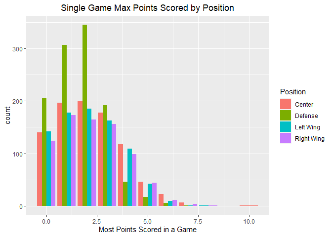
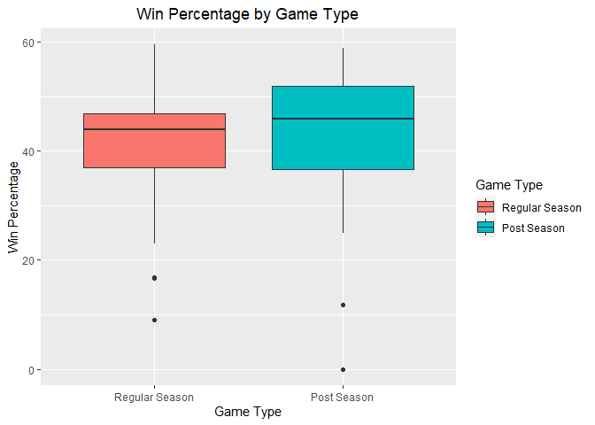
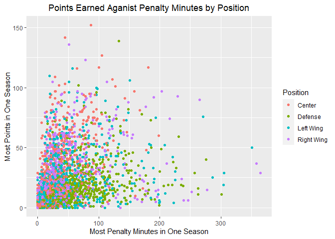
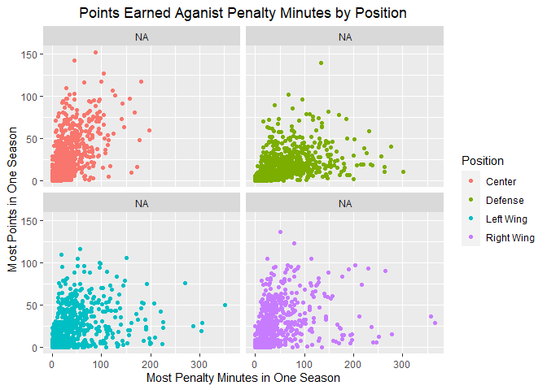
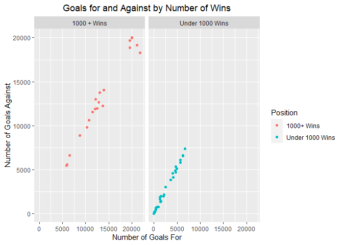
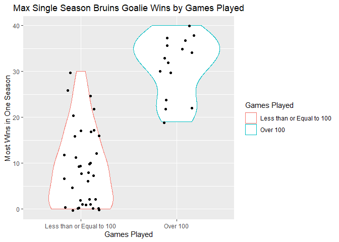

ST 558 Project 1
================
Kera Whitley
6/9/2021

-   [Base Functions](#base-functions)
    -   [Franchise Information](#franchise-information)
    -   [Franchise Totals](#franchise-totals)
    -   [Season Records](#season-records)
    -   [Goalie Records](#goalie-records)
    -   [Skater Records](#skater-records)
    -   [Franchise Details](#franchise-details)
    -   [Franchise Stats](#franchise-stats)
-   [Wrapper Function](#wrapper-function)
-   [Using the Functions](#using-the-functions)
    -   [Gathering Information](#gathering-information)
-   [Creating New Variables](#creating-new-variables)
-   [Tables and Plots](#tables-and-plots)
    -   [Contingency Tables](#contingency-tables)
    -   [Numerical Summaries](#numerical-summaries)
    -   [Plots](#plots)

# Base Functions

## Franchise Information

``` r
Franchise <- function(name = NULL){
  base_url <- "https://records.nhl.com/site/api/franchise?"
  get_franch <- GET(base_url)
  get_franch_text <- content(get_franch, as = "text", encoding = "UTF-8")
  get_franch_json <- fromJSON(get_franch_text, flatten = TRUE)
  franch.list <- as_tibble(get_franch_json$data) %>% rename(franchiseId = id)   
  #id was confirmed to be franchiseId by comparing to other API calls
  if (is.character(name)) 
    # If a team is specified, the fullname, common name, place name, abbreviation and id can all be used
    # If no team is specified all teams will be returned.
    return(franch.list %>% 
             filter(fullName == name | teamCommonName == name | teamPlaceName == name | teamAbbrev == name)) else               if (is.null(name)) return(franch.list) else
                 return(franch.list %>% filter(franchiseId == name)) 
  
  invisible()
}
```

## Franchise Totals

``` r
FranchiseTotals <- function(id = NULL){
  base_url <- "https://records.nhl.com/site/api/franchise-team-totals"
  get_franch <- GET(base_url)
  get_franch_text <- content(get_franch, as = "text", encoding = "UTF-8")
  get_franch_json <- fromJSON(get_franch_text, flatten = TRUE)
  totsList <- as_tibble(get_franch_json$data) %>% rename(teamAbbrev = triCode) %>% select(2:30) # Select all but id
  totsList$activeFranchise <- ifelse(totsList$activeFranchise == 1, TRUE, FALSE) 
  # Change activeFranchise from 1/0 to logical to match later API calls
  return(totsList)

  invisible()
}
```

## Season Records

``` r
SeasonRecords <- function(id){
  base_url <- "https://records.nhl.com/site/api/franchise-season-records?cayenneExp=franchiseId"
  full_url <- paste0(base_url, "=", id)
  get_franch <- GET(full_url)
  get_franch_text <- content(get_franch, as = "text", encoding = "UTF-8")
  get_franch_json <- fromJSON(get_franch_text, flatten = TRUE)
  totsList <- as_tibble(get_franch_json$data) %>% select(2:57) %>% rename(fullName = franchiseName)
  # Select all but id, and rename franchiseName to match other calls
  return(totsList)

  invisible()
}
```

## Goalie Records

``` r
GoalieRecords <- function(id){
  base_url <- "https://records.nhl.com/site/api/franchise-goalie-records?cayenneExp=franchiseId"
  full_url <- paste0(base_url, "=", id)
  get_franch <- GET(full_url)
  get_franch_text <- content(get_franch, as = "text", encoding = "UTF-8")
  get_franch_json <- fromJSON(get_franch_text, flatten = TRUE)
  GoalieList <- as_tibble(get_franch_json$data) %>% select(2:29) %>% rename(fullName = franchiseName)
  # Select all but id, and rename franchiseName to match other calls
  return(GoalieList)

  invisible()
}
```

## Skater Records

``` r
SkaterRecords <- function(id){
  base_url <- "https://records.nhl.com/site/api/franchise-skater-records?cayenneExp=franchiseId"
  full_url <- paste0(base_url, "=", id)
  get_franch <- GET(full_url)
  get_franch_text <- content(get_franch, as = "text", encoding = "UTF-8")
  get_franch_json <- fromJSON(get_franch_text, flatten = TRUE)
  skaterList <- as_tibble(get_franch_json$data) %>% select(2:31) %>% rename(fullName = franchiseName)
  # Select all but id, and rename franchiseName to match other calls
  return(skaterList)

  invisible()
}
```

## Franchise Details

``` r
FranchiseDetails <- function(id){
  base_url <- "https://records.nhl.com/site/api/franchise-detail?cayenneExp=mostRecentTeamId"
  full_url <- paste0(base_url, "=", id)
  get_franch <- GET(full_url)
  get_franch_text <- content(get_franch, as = "text", encoding = "UTF-8")
  get_franch_json <- fromJSON(get_franch_text, flatten = TRUE)
  detailList <- as_tibble(get_franch_json$data) %>% select(2:13) %>% 
    rename(fullName = teamFullName, activeFranchise = active)
  
  names <- colnames(detailList)
  # Four variables returned a string from HTML. The following code split it into a list
  cap <- detailList$captainHistory %>% read_xml(as_html = TRUE) %>% xml_text() %>% strsplit("\r\n\t")
  coa <- detailList$coachingHistory %>% read_xml(as_html = TRUE) %>% xml_text() %>% strsplit("\r\n\t")
  gmh <- detailList$generalManagerHistory %>% read_xml(as_html = TRUE) %>% xml_text() %>% strsplit("\r\n\t")
  rns <- detailList$retiredNumbersSummary %>% read_xml(as_html = TRUE) %>% xml_text() %>% strsplit("\r\n\t")

  # The same code was run for each of the four of the above new variables to create four separate data sets
  a <- as.data.frame(matrix(rep(detailList), nrow = length(cap[[1]]), ncol = length(detailList), byrow = TRUE))
  for (i in 1:length(cap[[1]])){
    a[[2]][i] <- cap[[1]][i]
  }
  CaptainDetails <- as_tibble(a) 
  colnames(CaptainDetails) <- names
  CaptainDetails <- CaptainDetails %>% select(!contains(c("coach", "general", "retired")))
  CaptainDetails <- CaptainDetails %>% unnest(c(activeFranchise, captainHistory, dateAwarded, directoryUrl,
                                                firstSeasonId, heroImageUrl, mostRecentTeamId, teamAbbrev,
                                                fullName))
  
  a <- as.data.frame(matrix(rep(detailList), nrow = length(coa[[1]]), ncol = length(detailList), byrow = TRUE))
  for (i in 1:length(coa[[1]])){
    a[[3]][i] <- coa[[1]][i]
  }
  CoachDetails <- as_tibble(a)
  colnames(CoachDetails) <- names
  CoachDetails <- CoachDetails %>% select(!contains(c("captain", "general", "retired")))
  CoachDetails <- CoachDetails %>% unnest(c(activeFranchise, coachingHistory, dateAwarded, directoryUrl,
                                            firstSeasonId, heroImageUrl, mostRecentTeamId, teamAbbrev, fullName))
  
  a <- as.data.frame(matrix(rep(detailList), nrow = length(gmh[[1]]), ncol = length(detailList), byrow = TRUE))
  for (i in 1:length(gmh[[1]])){
    a[[7]][i] <- gmh[[1]][i]
  }
  GMDetails <- as_tibble(a)
  colnames(GMDetails) <- names
  GMDetails <- GMDetails %>% select(!contains(c("captain", "coach", "retired")))
  GMDetails <- GMDetails %>% unnest(c(activeFranchise, dateAwarded, directoryUrl, firstSeasonId,
                                      generalManagerHistory, heroImageUrl, mostRecentTeamId, teamAbbrev, fullName))
  
  a <- as.data.frame(matrix(rep(detailList), nrow = length(rns[[1]]), ncol = length(detailList), byrow = TRUE))
  for (i in 1:length(rns[[1]])){
    a[[10]][i] <- rns[[1]][i]
  }
  RetiredDetails <- as_tibble(a)
  colnames(RetiredDetails) <- names
  RetiredDetails <- RetiredDetails %>% select(!contains(c("captain", "coach", "general")))
  RetiredDetails <- RetiredDetails %>% unnest(c(activeFranchise, dateAwarded, directoryUrl, firstSeasonId,
                                                heroImageUrl, mostRecentTeamId, retiredNumbersSummary, teamAbbrev,
                                                fullName))
  
  # The four newly created datasets were returned separately as they all have potentially different 
  # numbers of observations
  return(list(CaptainDetails = CaptainDetails, CoachDetails = CoachDetails, GMDetails = GMDetails,
              RetiredDetails = RetiredDetails))

  invisible()
}
```

## Franchise Stats

``` r
TeamStats <- function(name = NULL){
  base_url <- "https://statsapi.web.nhl.com/api/v1/teams"
  if (is.null(name)) full_url <- paste0(base_url, "?expand=team.stats") else
    full_url <- paste0(base_url, "/", name, "?expand=team.stats")
  get_stats <- GET(full_url)
  get_stats_text <- content(get_stats, as = "text", encoding = "UTF-8")
  get_stats_json <- fromJSON(get_stats_text, flatten = TRUE)
  TeamList <- as_tibble(get_stats_json$teams) %>% 
    select(!(contains(c("link", "Url", "franchise.", "short"))), -1) %>% 
    rename(teamAbbrev = abbreviation, teamCommonName = teamName, teamPlaceName = locationName,
           fullName = name) # Rename was used to match other API call variable names
  Season <- TeamList %>% unnest(teamStats)
  
  # Season is used and unnested twice, once for the stats numbers and once for the rankings
  StatsNums <-Season %>% unnest(splits) %>% filter(!is.na(stat.gamesPlayed)) 
  # Converting the stats numbers to numerics for computation later. This isn't done for ranks.
  Stats <- StatsNums %>% select(starts_with(c("stat", "first"))) %>% mutate_if(is.character, as.numeric)
  Franch <- Season %>% select(1:4, 7:22)
  StatsNums <- cbind(Franch, Stats)
  StatsRank <- Season %>% unnest(splits) %>% filter(is.na(stat.gamesPlayed))

  return(list(StatsNumbers = StatsNums, StatsRank = StatsRank))

  invisible()
}
```

# Wrapper Function

Here, franchise is always called so that the name can be converted to an
ID number for the other API calls and the numbers should always be up to
date. If no team was designated in name, then the Montreal Canadiens
will be returned for all functions that only output one team.

# Using the Functions

## Gathering Information

``` r
# Create two 
allTots <- StatsNHL("totals")
allStat <- StatsNHL("stats")
allComb <- left_join(allTots, allStat$StatsNumbers)
```

    ## Joining, by = c("franchiseId", "teamAbbrev")

``` r
regSeason <- allComb %>% filter(gameTypeId == 2)


s1 <- StatsNHL("s.records", name = 1)
s5 <- StatsNHL("s.records", name = 5)
s6 <- StatsNHL("s.records", name = 6)
s10 <- StatsNHL("s.records", name = 10)
skater <- rbind(s1, s5, s6, s10)

goal <- StatsNHL("g.records", name = "Bruins")

franch <- StatsNHL("franch")
```

# Creating New Variables

``` r
# Creating new
winPercent <- (allComb$wins/allComb$gamesPlayed) * 100
lossPercent <- 100 - winpercent
allComb$winPercent <- winPercent
allComb$lossPercent <- lossPercent

allComb$shuts <- ifelse(allComb$shutouts < 100, allComb$shuts <- "Less than 100", 
                        ifelse(allComb$shutouts < 200, allComb$shuts <- "Less than 200",
                               allComb$shuts <-  "Over 200"))

skater$skatePosCode <- ifelse(skater$positionCode == "C", skater$skatePosCode <- "Center", 
                              ifelse(skater$positionCode == "D", skater$skatePosCode <- "Defense",
                                     ifelse(skater$positionCode == "L", skater$skatePosCode <- "Left Wing",
                                            skater$skatePosCode <- "Right Wing")))

regSeason$dummyWins <- ifelse(regSeason$wins < 1000, regSeason$dummyWins <- "Under 1000 Wins", 
                              regSeason$dummyWins <- "1000 + Wins")
regSeason$dummyStartYear <-
  ifelse(regSeason$firstSeasonId <= 19181919, regSeason$dummyStartYear <- "Before 1920", 
         ifelse(regSeason$firstSeasonId <= 19381939, regSeason$dummyStartYear <-"1920 - 1939",
                ifelse(regSeason$firstSeasonId <= 19581959, regSeason$dummyStartYear <- "1940 - 1959", 
                       ifelse(regSeason$firstSeasonId <= 19781979, regSeason$dummyStartYear <- "1960 - 1979",
                              ifelse(regSeason$firstSeasonId <= 19981999, regSeason$dummyStartYear <-
                                       "1980 - 1999", "After 2000")))))
regSeason$dummyStartYear <- factor(regSeason$dummyStartYear, 
                                   labels =c("Before 1920", "1920 - 1939", "1940 - 1959", "1960 - 1979",
                                             "1980 - 1999", "After 2000"))

goal$gamePlayedBin <- ifelse(goal$gamesPlayed <= 100, "lesseq100", "over100")
```

# Tables and Plots

## Contingency Tables

``` r
table(allComb$shuts, allComb$division.name) %>% kable(caption = "Regular Season Shutouts by Division")
```

|               | Discover Central | Honda West | MassMutual East | Scotia North |
|:--------------|-----------------:|-----------:|----------------:|-------------:|
| Less than 100 |                9 |         10 |               8 |            8 |
| Less than 200 |                5 |          4 |               5 |            4 |
| Over 200      |                2 |          2 |               3 |            2 |

Regular Season Shutouts by Division

``` r
table(skater$skatePosCode, skater$mostGoalsOneGame) %>% kable(caption = "Points by Skater Position for Selected Franchises")
```

|            |   0 |   1 |   2 |   3 |   4 |   5 |   6 |
|:-----------|----:|----:|----:|----:|----:|----:|----:|
| Center     | 219 | 303 | 213 | 133 |  28 |   7 |   3 |
| Defense    | 378 | 533 | 174 |  27 |   5 |   1 |   0 |
| Left Wing  | 205 | 260 | 219 | 119 |  27 |   0 |   0 |
| Right Wing | 189 | 233 | 206 | 115 |  25 |   8 |   0 |

Points by Skater Position for Selected Franchises

``` r
table(skater$skatePosCode, skater$seasons) %>% kable(caption = "Number Seasons Played by Skater Position for Selected Franchises")
```

|            |   1 |   2 |   3 |   4 |   5 |   6 |   7 |   8 |   9 |  10 |  11 |  12 |  13 |  14 |  15 |  16 |  17 |  18 |  20 |  21 |
|:-----------|----:|----:|----:|----:|----:|----:|----:|----:|----:|----:|----:|----:|----:|----:|----:|----:|----:|----:|----:|----:|
| Center     | 361 | 205 | 124 |  69 |  37 |  32 |  20 |  14 |  11 |   9 |   0 |   6 |   6 |   3 |   4 |   2 |   1 |   0 |   2 |   0 |
| Defense    | 471 | 205 | 154 |  88 |  50 |  25 |  40 |  22 |  10 |   6 |   7 |  10 |   8 |   8 |   5 |   4 |   3 |   0 |   1 |   1 |
| Left Wing  | 341 | 194 | 100 |  54 |  37 |  31 |  11 |  17 |   9 |  10 |   7 |   7 |   5 |   1 |   1 |   3 |   1 |   0 |   0 |   1 |
| Right Wing | 338 | 159 |  96 |  56 |  29 |  26 |  12 |  15 |  14 |   8 |   7 |   5 |   1 |   3 |   1 |   2 |   0 |   2 |   1 |   1 |

Number Seasons Played by Skater Position for Selected Franchises

``` r
table(regSeason$dummyStartYear, regSeason$division.name)
```

    ##              
    ##               Discover Central Honda West MassMutual East Scotia North
    ##   Before 1920                2          0               2            1
    ##   1920 - 1939                0          0               0            0
    ##   1940 - 1959                0          2               5            1
    ##   1960 - 1979                5          3               1            3
    ##   1980 - 1999                1          3               0            1
    ##   After 2000                 0          0               0            1

## Numerical Summaries

``` r
goal %>% select(!contains(c("Dates", "Id", "rookie", "over", "bin", "Name", "active", "Code"))) %>% summary() %>% kable(caption = "Bruins Goalie Stats")
```

|     | gamesPlayed   | losses         | mostGoalsAgainstOneGame | mostSavesOneGame | mostShotsAgainstOneGame | mostShutoutsOneSeason | mostWinsOneSeason | seasons        | shutouts       | ties          | wins          |
|:----|:--------------|:---------------|:------------------------|:-----------------|:------------------------|:----------------------|:------------------|:---------------|:---------------|:--------------|:--------------|
|     | Min. : 1.0    | Min. : 0.00    | Min. : 2.000            | Min. :13.0       | Min. :15.00             | Min. : 0.000          | Min. : 0.00       | Min. : 1.000   | Min. : 0.000   | Min. : 0.00   | Min. : 0.0    |
|     | 1st Qu.: 8.0  | 1st Qu.: 3.50  | 1st Qu.: 6.000          | 1st Qu.:33.0     | 1st Qu.:36.00           | 1st Qu.: 0.000        | 1st Qu.: 3.50     | 1st Qu.: 1.000 | 1st Qu.: 0.000 | 1st Qu.: 0.00 | 1st Qu.: 4.0  |
|     | Median : 36.0 | Median : 14.00 | Median : 7.000          | Median :39.0     | Median :42.00           | Median : 2.000        | Median :12.00     | Median : 2.000 | Median : 2.000 | Median : 6.00 | Median : 15.0 |
|     | Mean :107.8   | Mean : 36.18   | Mean : 7.078            | Mean :36.9       | Mean :40.35             | Mean : 3.098          | Mean :15.65       | Mean : 3.059   | Mean : 8.412   | Mean :14.25   | Mean : 52.8   |
|     | 3rd Qu.:147.5 | 3rd Qu.: 52.00 | 3rd Qu.: 8.000          | 3rd Qu.:42.0     | 3rd Qu.:44.25           | 3rd Qu.: 4.000        | 3rd Qu.:25.50     | 3rd Qu.: 3.500 | 3rd Qu.: 9.500 | 3rd Qu.:16.25 | 3rd Qu.: 66.0 |
|     | Max. :560.0   | Max. :192.00   | Max. :13.000            | Max. :51.0       | Max. :57.00             | Max. :15.000          | Max. :40.00       | Max. :14.000   | Max. :74.000   | Max. :76.00   | Max. :306.0   |
|     | NA            | NA             | NA                      | NA’s :11         | NA’s :11                | NA                    | NA                | NA             | NA             | NA’s :7       | NA            |

Bruins Goalie Stats

``` r
skater %>% select(!contains(c("Dates", "Id", "rookie", "over", "bin", "Name", "active", "Code"))) %>% summary() %>% kable( caption = "Skater Stats for Selected Franchises")
```

|     | assists        | gamesPlayed    | goals          | mostAssistsOneGame | mostAssistsOneSeason | mostGoalsOneGame | mostGoalsOneSeason | mostPenaltyMinutesOneSeason | mostPointsOneGame | mostPointsOneSeason | penaltyMinutes | points         | seasons        |
|:----|:---------------|:---------------|:---------------|:-------------------|:---------------------|:-----------------|:-------------------|:----------------------------|:------------------|:--------------------|:---------------|:---------------|:---------------|
|     | Min. : 0.00    | Min. : 1.0     | Min. : 0.00    | Min. :0.000        | Min. : 0.00          | Min. :0.00       | Min. : 0.000       | Min. : 0.00                 | Min. : 0.000      | Min. : 0.00         | Min. : 0.00    | Min. : 0.00    | Min. : 1.000   |
|     | 1st Qu.: 1.00  | 1st Qu.: 12.0  | 1st Qu.: 0.00  | 1st Qu.:1.000      | 1st Qu.: 1.00        | 1st Qu.:0.00     | 1st Qu.: 0.000     | 1st Qu.: 4.00               | 1st Qu.: 1.000    | 1st Qu.: 1.00       | 1st Qu.: 4.00  | 1st Qu.: 2.00  | 1st Qu.: 1.000 |
|     | Median : 7.00  | Median : 50.0  | Median : 4.00  | Median :1.000      | Median : 6.00        | Median :1.00     | Median : 3.000     | Median : 20.00              | Median : 2.000    | Median : 10.00      | Median : 26.00 | Median : 12.00 | Median : 2.000 |
|     | Mean : 35.73   | Mean : 119.7   | Mean : 23.02   | Mean :1.578        | Mean : 11.41         | Mean :1.26       | Mean : 7.537       | Mean : 35.44                | Mean : 2.018      | Mean : 18.37        | Mean : 96.68   | Mean : 58.74   | Mean : 2.884   |
|     | 3rd Qu.: 33.00 | 3rd Qu.: 144.0 | 3rd Qu.: 19.00 | 3rd Qu.:2.000      | 3rd Qu.: 17.00       | 3rd Qu.:2.00     | 3rd Qu.:11.000     | 3rd Qu.: 50.00              | 3rd Qu.: 3.000    | 3rd Qu.: 27.00      | 3rd Qu.: 96.00 | 3rd Qu.: 52.00 | 3rd Qu.: 3.000 |
|     | Max. :1111.00  | Max. :1518.0   | Max. :545.00   | Max. :6.000        | Max. :102.00         | Max. :6.00       | Max. :76.000       | Max. :365.00                | Max. :10.000      | Max. :152.00        | Max. :2265.00  | Max. :1506.00  | Max. :21.000   |

Skater Stats for Selected Franchises

``` r
skater %>% filter(franchiseId == 1) %>% select(!contains(c("Dates", "Id", "rookie", "over", "bin", "Name", "active", "Code"))) %>% summary() %>% kable(caption = "Montreal Canadiens Skater Stats")
```

|     | assists        | gamesPlayed    | goals          | mostAssistsOneGame | mostAssistsOneSeason | mostGoalsOneGame | mostGoalsOneSeason | mostPenaltyMinutesOneSeason | mostPointsOneGame | mostPointsOneSeason | penaltyMinutes | points         | seasons        |
|:----|:---------------|:---------------|:---------------|:-------------------|:---------------------|:-----------------|:-------------------|:----------------------------|:------------------|:--------------------|:---------------|:---------------|:---------------|
|     | Min. : 0.00    | Min. : 1.0     | Min. : 0.00    | Min. :0.000        | Min. : 0.00          | Min. :0.000      | Min. : 0.000       | Min. : 0.00                 | Min. :0.000       | Min. : 0.00         | Min. : 0.0     | Min. : 0.00    | Min. : 1.000   |
|     | 1st Qu.: 1.00  | 1st Qu.: 11.0  | 1st Qu.: 0.00  | 1st Qu.:1.000      | 1st Qu.: 1.00        | 1st Qu.:0.000    | 1st Qu.: 0.000     | 1st Qu.: 4.00               | 1st Qu.:1.000     | 1st Qu.: 1.00       | 1st Qu.: 4.0   | 1st Qu.: 1.00  | 1st Qu.: 1.000 |
|     | Median : 7.00  | Median : 49.0  | Median : 4.00  | Median :1.000      | Median : 5.00        | Median :1.000    | Median : 3.000     | Median : 19.00              | Median :2.000     | Median : 8.50       | Median : 26.0  | Median : 11.00 | Median : 2.000 |
|     | Mean : 41.50   | Mean : 137.1   | Mean : 27.16   | Mean :1.577        | Mean :11.41          | Mean :1.291      | Mean : 7.639       | Mean : 33.59                | Mean :2.055       | Mean : 18.41        | Mean : 107.6   | Mean : 68.66   | Mean : 3.256   |
|     | 3rd Qu.: 35.25 | 3rd Qu.: 169.2 | 3rd Qu.: 22.00 | 3rd Qu.:2.000      | 3rd Qu.:17.00        | 3rd Qu.:2.000    | 3rd Qu.:11.000     | 3rd Qu.: 50.00              | 3rd Qu.:3.000     | 3rd Qu.: 28.00      | 3rd Qu.: 103.0 | 3rd Qu.: 60.00 | 3rd Qu.: 4.000 |
|     | Max. :728.00   | Max. :1258.0   | Max. :544.00   | Max. :6.000        | Max. :82.00          | Max. :6.000      | Max. :60.000       | Max. :358.00                | Max. :8.000       | Max. :136.00        | Max. :2248.0   | Max. :1246.00  | Max. :20.000   |

Montreal Canadiens Skater Stats

``` r
skater %>% filter(franchiseId == 6) %>% select(!contains(c("Dates", "Id", "rookie", "over", "bin", "Name", "active", "Code"))) %>% summary() %>% kable(caption = "Boston Bruins Skater Stats")
```

|     | assists        | gamesPlayed    | goals          | mostAssistsOneGame | mostAssistsOneSeason | mostGoalsOneGame | mostGoalsOneSeason | mostPenaltyMinutesOneSeason | mostPointsOneGame | mostPointsOneSeason | penaltyMinutes | points         | seasons        |
|:----|:---------------|:---------------|:---------------|:-------------------|:---------------------|:-----------------|:-------------------|:----------------------------|:------------------|:--------------------|:---------------|:---------------|:---------------|
|     | Min. : 0.00    | Min. : 1.0     | Min. : 0.00    | Min. :0.000        | Min. : 0.00          | Min. :0.000      | Min. : 0.000       | Min. : 0.00                 | Min. :0.000       | Min. : 0.00         | Min. : 0.00    | Min. : 0.00    | Min. : 1.000   |
|     | 1st Qu.: 1.00  | 1st Qu.: 14.0  | 1st Qu.: 0.00  | 1st Qu.:1.000      | 1st Qu.: 1.00        | 1st Qu.:0.000    | 1st Qu.: 0.000     | 1st Qu.: 4.00               | 1st Qu.:1.000     | 1st Qu.: 1.25       | 1st Qu.: 4.00  | 1st Qu.: 2.00  | 1st Qu.: 1.000 |
|     | Median : 7.00  | Median : 50.0  | Median : 4.00  | Median :1.000      | Median : 6.00        | Median :1.000    | Median : 4.000     | Median : 20.00              | Median :2.000     | Median : 10.00      | Median : 26.00 | Median : 12.00 | Median : 2.000 |
|     | Mean : 35.83   | Mean : 117.5   | Mean : 22.92   | Mean :1.554        | Mean : 11.37         | Mean :1.247      | Mean : 7.645       | Mean : 34.76                | Mean :1.996       | Mean : 18.53        | Mean : 94.42   | Mean : 58.75   | Mean : 2.843   |
|     | 3rd Qu.: 28.00 | 3rd Qu.: 134.0 | 3rd Qu.: 19.00 | 3rd Qu.:2.000      | 3rd Qu.: 17.00       | 3rd Qu.:2.000    | 3rd Qu.:10.750     | 3rd Qu.: 48.00              | 3rd Qu.:3.000     | 3rd Qu.: 26.00      | 3rd Qu.: 89.75 | 3rd Qu.: 48.00 | 3rd Qu.: 3.000 |
|     | Max. :1111.00  | Max. :1518.0   | Max. :545.00   | Max. :6.000        | Max. :102.00         | Max. :4.000      | Max. :76.000       | Max. :304.00                | Max. :7.000       | Max. :152.00        | Max. :2095.00  | Max. :1506.00  | Max. :21.000   |

Boston Bruins Skater Stats

``` r
regSeason %>% select("stat.wins", "stat.losses", "stat.ot", "stat.pts", "stat.goalsPerGame") %>% summary() %>%
  kable(caption = "Selected League Summary Statistics, Regular Season")
```

|     | stat.wins  | stat.losses   | stat.ot       | stat.pts      | stat.goalsPerGame |
|:----|:-----------|:--------------|:--------------|:--------------|:------------------|
|     | Min. :15   | Min. :12.00   | Min. : 2.00   | Min. :37.00   | Min. :2.214       |
|     | 1st Qu.:23 | 1st Qu.:16.00 | 1st Qu.: 4.00 | 1st Qu.:50.50 | 1st Qu.:2.661     |
|     | Median :27 | Median :23.00 | Median : 7.00 | Median :60.00 | Median :2.839     |
|     | Mean :28   | Mean :21.71   | Mean : 6.29   | Mean :62.29   | Mean :2.898       |
|     | 3rd Qu.:35 | 3rd Qu.:27.00 | 3rd Qu.: 7.50 | 3rd Qu.:75.00 | 3rd Qu.:3.214     |
|     | Max. :40   | Max. :34.00   | Max. :14.00   | Max. :82.00   | Max. :3.518       |
|     | NA’s :26   | NA’s :26      | NA’s :26      | NA’s :26      | NA’s :26          |

Selected League Summary Statistics, Regular Season

## Plots

``` r
# Bar plot
a <- ggplot(skater, aes(mostPointsOneGame, fill = positionCode))

a + geom_bar(position = "dodge") + 
  labs(x = "Most Points Scored in a Game", title = "Single Game Max Points Scored by Position") +
  theme(plot.title = element_text(hjust = 0.5)) +
  scale_fill_discrete(name = "Position", labels = c("Center", "Defense", "Left Wing", "Right Wing"))
```

<!-- -->

``` r
# Histogram
b <- ggplot(skater, aes(penaltyMinutes, fill = fullName))

b + geom_histogram(position = "dodge", bins = 30) +
  labs(x = "Total Career Penalty Minutes", title = "Career Penalty Minutes by Postion") +
  theme(plot.title = element_text(hjust = 0.5)) +
  facet_wrap(vars(fullName), scales = "free") +
  scale_fill_discrete(name = "Team")
```

<!-- -->

``` r
# Box plot
c <- ggplot(allComb, aes(x = as.factor(gameTypeId), y = winPercent, fill = as.factor(gameTypeId)))

c + geom_boxplot() + 
  labs(x = "Game Type", y = "Win Percentage", title = "Win Percentage by Game Type") + 
  scale_x_discrete(labels = c("Regular Season", "Post Season")) +
  theme(plot.title = element_text(hjust = 0.5)) +
  scale_fill_discrete(name = "Game Type", labels = c("Regular Season", "Post Season"))
```

<!-- -->

``` r
# Scatter plot
d <- ggplot(skater, aes(mostPenaltyMinutesOneSeason, mostPointsOneSeason))

d + geom_point(aes(color = positionCode)) +
  labs(x = "Most Penalty Minutes in One Season", y = "Most Points in One Season",
       title = "Points Earned Aganist Penalty Minutes by Position") +
  theme(plot.title = element_text(hjust = 0.5)) + 
  scale_color_discrete(name = "Position", labels = c("Center", "Defense", "Left Wing", "Right Wing"))
```

<!-- -->

``` r
d + geom_point(aes(color = positionCode)) +
  facet_wrap(vars(positionCode), labeller = labeller(positionCode =
                                                       c("Center", "Defense", "Left Wing", "Right Wing"))) +
  labs(x = "Most Penalty Minutes in One Season", y = "Most Points in One Season",
       title = "Points Earned Aganist Penalty Minutes by Position") +
  theme(plot.title = element_text(hjust = 0.5)) + 
  scale_color_discrete(name = "Position", labels = c("Center", "Defense", "Left Wing", "Right Wing"))
```

<!-- -->

``` r
e <- ggplot(regSeason, aes(goalsFor, goalsAgainst))

e + geom_point(aes(color = dummyWins)) +
  facet_wrap(vars(dummyWins)) +
  labs(x = "Number of Goals For", y = "Number of Goals Against",
       title = "Goals for and Against by Number of Wins") +
  theme(plot.title = element_text(hjust = 0.5)) + 
  scale_color_discrete(name = "Position", labels = c("1000+ Wins", "Under 1000 Wins"))
```

<!-- -->

``` r
# Coder's choice violin?

f <- ggplot(goal, aes(as.factor(gamePlayedBin), mostWinsOneSeason))

f + geom_violin(aes(color = gamePlayedBin)) +
  geom_jitter(shape = 16, position = position_jitter(0.2)) +
  labs(x = "Games Played", y = "Most Wins in One Season", 
       title = "Max Single Season Bruins Goalie Wins by Games Played") +
  theme(plot.title = element_text(hjust = 0.5)) +
  scale_x_discrete(labels = c("Less than or Equal to 100", "Over 100")) +
  scale_color_discrete(name = "Games Played", labels = c("Less than or Equal to 100", "Over 100"))
```

<!-- -->
