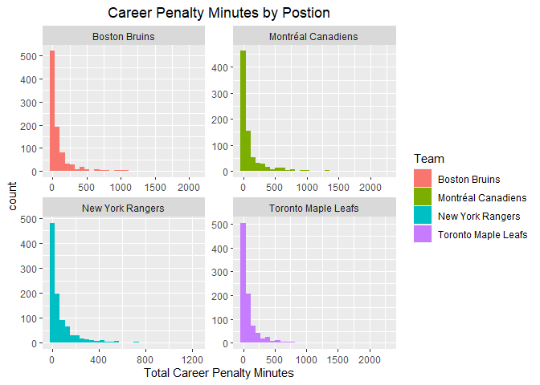
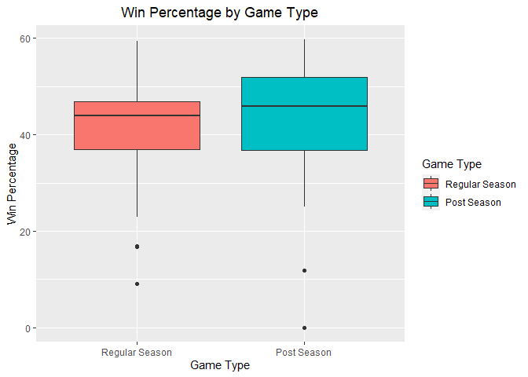
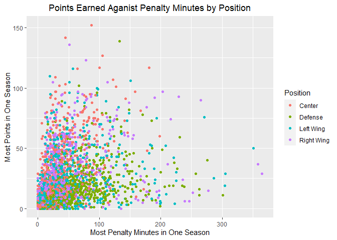
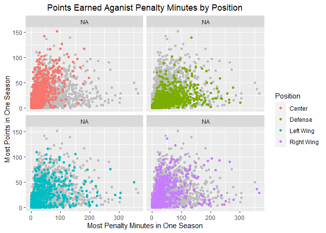
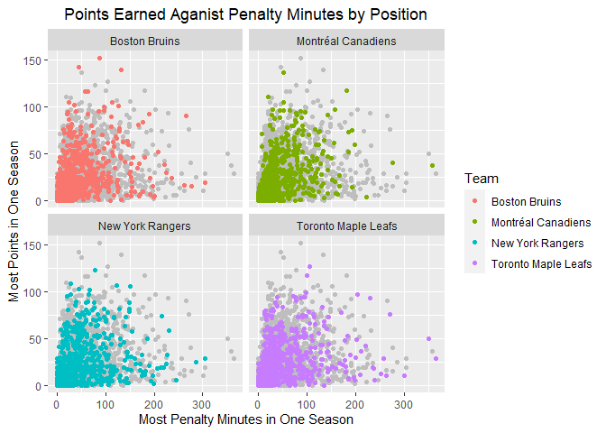
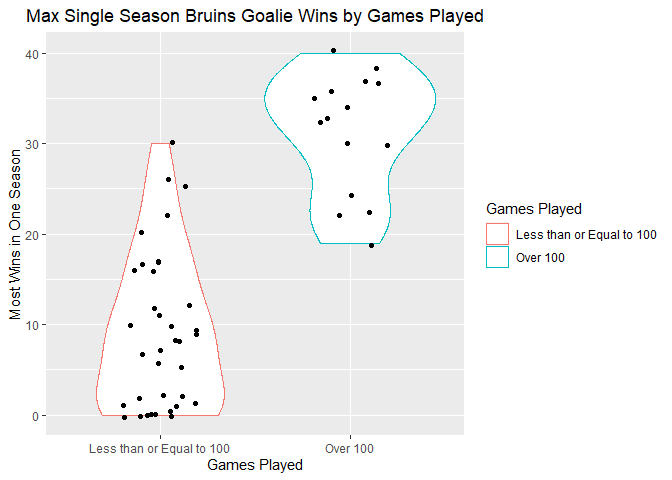

ST 558 Project 1
================
Kera Whitley
6/9/2021

``` r
library(httr)
library(jsonlite)
library(tidyverse)
library(knitr)
```

You should write functions to contact the NHL records API for the
endpoints listed below. The functions should return well-formatted,
parsed data (usually a data frame). Where possible, the user should have
the option to specify the franchise of choice by both name and ID number
- you’ll need to map the names to ID numbers yourself.

– /franchise (Returns id, firstSeasonId and lastSeasonId and name of
every team in the history of the NHL)

``` r
Franchise <- function(name = NULL){
  base_url <- "https://records.nhl.com/site/api/franchise?"
  get_franch <- GET(base_url)
  get_franch_text <- content(get_franch, as = "text", encoding = "UTF-8")
  get_franch_json <- fromJSON(get_franch_text, flatten = TRUE)
  franch.list <- as_tibble(get_franch_json$data) %>% rename(franchiseId = id) 
  #id was confirmed to be franchiseId by comparing to other API calls
  if (is.character(name)) 
    return(franch.list %>% 
             filter(fullName == name | teamCommonName == name | teamPlaceName == name)) else 
               if (is.null(name)) return(franch.list) else
                 return(franch.list %>% filter(franchiseId == name)) 
  
  invisible()
}

Franchise()
```

    ## # A tibble: 39 x 8
    ##    franchiseId firstSeasonId fullName   lastSeasonId mostRecentTeamId teamAbbrev
    ##          <int>         <int> <chr>             <int>            <int> <chr>     
    ##  1           1      19171918 Montréal ~           NA                8 MTL       
    ##  2           2      19171918 Montreal ~     19171918               41 MWN       
    ##  3           3      19171918 St. Louis~     19341935               45 SLE       
    ##  4           4      19191920 Hamilton ~     19241925               37 HAM       
    ##  5           5      19171918 Toronto M~           NA               10 TOR       
    ##  6           6      19241925 Boston Br~           NA                6 BOS       
    ##  7           7      19241925 Montreal ~     19371938               43 MMR       
    ##  8           8      19251926 Brooklyn ~     19411942               51 BRK       
    ##  9           9      19251926 Philadelp~     19301931               39 QUA       
    ## 10          10      19261927 New York ~           NA                3 NYR       
    ## # ... with 29 more rows, and 2 more variables: teamCommonName <chr>,
    ## #   teamPlaceName <chr>

``` r
Franchise("Boston Bruins")
```

    ## # A tibble: 1 x 8
    ##   franchiseId firstSeasonId fullName    lastSeasonId mostRecentTeamId teamAbbrev
    ##         <int>         <int> <chr>              <int>            <int> <chr>     
    ## 1           6      19241925 Boston Bru~           NA                6 BOS       
    ## # ... with 2 more variables: teamCommonName <chr>, teamPlaceName <chr>

``` r
Franchise("Sharks")
```

    ## # A tibble: 1 x 8
    ##   franchiseId firstSeasonId fullName    lastSeasonId mostRecentTeamId teamAbbrev
    ##         <int>         <int> <chr>              <int>            <int> <chr>     
    ## 1          29      19911992 San Jose S~           NA               28 SJS       
    ## # ... with 2 more variables: teamCommonName <chr>, teamPlaceName <chr>

``` r
Franchise("New York")
```

    ## # A tibble: 2 x 8
    ##   franchiseId firstSeasonId fullName    lastSeasonId mostRecentTeamId teamAbbrev
    ##         <int>         <int> <chr>              <int>            <int> <chr>     
    ## 1          10      19261927 New York R~           NA                3 NYR       
    ## 2          22      19721973 New York I~           NA                2 NYI       
    ## # ... with 2 more variables: teamCommonName <chr>, teamPlaceName <chr>

``` r
Franchise(18)
```

    ## # A tibble: 1 x 8
    ##   franchiseId firstSeasonId fullName    lastSeasonId mostRecentTeamId teamAbbrev
    ##         <int>         <int> <chr>              <int>            <int> <chr>     
    ## 1          18      19671968 St. Louis ~           NA               19 STL       
    ## # ... with 2 more variables: teamCommonName <chr>, teamPlaceName <chr>

– /franchise-team-totals (Returns Total stats for every franchise (ex
roadTies, roadWins, etc))

``` r
FranchiseTotals <- function(id = NULL){
  base_url <- "https://records.nhl.com/site/api/franchise-team-totals"
  get_franch <- GET(base_url)
  get_franch_text <- content(get_franch, as = "text", encoding = "UTF-8")
  get_franch_json <- fromJSON(get_franch_text, flatten = TRUE)
  totsList <- as_tibble(get_franch_json$data) %>% rename(teamAbbrev = triCode) %>% select(2:30)
  totsList$activeFranchise <- ifelse(totsList$activeFranchise == 1, TRUE, FALSE) 
  # Change activeFranchise from 1/0 to logical to match later API calls
  return(totsList)

  invisible()
}

FranchiseTotals()
```

    ## # A tibble: 105 x 29
    ##    activeFranchise firstSeasonId franchiseId gameTypeId gamesPlayed goalsAgainst
    ##    <lgl>                   <int>       <int>      <int>       <int>        <int>
    ##  1 TRUE                 19821983          23          2        2993         8902
    ##  2 TRUE                 19821983          23          3         257          634
    ##  3 TRUE                 19721973          22          2        3788        11907
    ##  4 TRUE                 19721973          22          3         309          897
    ##  5 TRUE                 19261927          10          2        6560        20020
    ##  6 TRUE                 19261927          10          3         518         1447
    ##  7 TRUE                 19671968          16          3         449         1332
    ##  8 TRUE                 19671968          16          2        4171        12255
    ##  9 TRUE                 19671968          17          2        4171        14049
    ## 10 TRUE                 19671968          17          3         391         1131
    ## # ... with 95 more rows, and 23 more variables: goalsFor <int>,
    ## #   homeLosses <int>, homeOvertimeLosses <int>, homeTies <int>, homeWins <int>,
    ## #   lastSeasonId <int>, losses <int>, overtimeLosses <int>,
    ## #   penaltyMinutes <int>, pointPctg <dbl>, points <int>, roadLosses <int>,
    ## #   roadOvertimeLosses <int>, roadTies <int>, roadWins <int>,
    ## #   shootoutLosses <int>, shootoutWins <int>, shutouts <int>, teamId <int>,
    ## #   teamName <chr>, ties <int>, teamAbbrev <chr>, wins <int>

``` r
FranchiseTotals(6)
```

    ## # A tibble: 105 x 29
    ##    activeFranchise firstSeasonId franchiseId gameTypeId gamesPlayed goalsAgainst
    ##    <lgl>                   <int>       <int>      <int>       <int>        <int>
    ##  1 TRUE                 19821983          23          2        2993         8902
    ##  2 TRUE                 19821983          23          3         257          634
    ##  3 TRUE                 19721973          22          2        3788        11907
    ##  4 TRUE                 19721973          22          3         309          897
    ##  5 TRUE                 19261927          10          2        6560        20020
    ##  6 TRUE                 19261927          10          3         518         1447
    ##  7 TRUE                 19671968          16          3         449         1332
    ##  8 TRUE                 19671968          16          2        4171        12255
    ##  9 TRUE                 19671968          17          2        4171        14049
    ## 10 TRUE                 19671968          17          3         391         1131
    ## # ... with 95 more rows, and 23 more variables: goalsFor <int>,
    ## #   homeLosses <int>, homeOvertimeLosses <int>, homeTies <int>, homeWins <int>,
    ## #   lastSeasonId <int>, losses <int>, overtimeLosses <int>,
    ## #   penaltyMinutes <int>, pointPctg <dbl>, points <int>, roadLosses <int>,
    ## #   roadOvertimeLosses <int>, roadTies <int>, roadWins <int>,
    ## #   shootoutLosses <int>, shootoutWins <int>, shutouts <int>, teamId <int>,
    ## #   teamName <chr>, ties <int>, teamAbbrev <chr>, wins <int>

– /site/api/franchise-season-records?cayenneExp=franchiseId=ID
(Drill-down into season records for a specific franchise)

``` r
SeasonRecords <- function(id){
  base_url <- "https://records.nhl.com/site/api/franchise-season-records?cayenneExp=franchiseId"
  full_url <- paste0(base_url, "=", id)
  get_franch <- GET(full_url)
  get_franch_text <- content(get_franch, as = "text", encoding = "UTF-8")
  get_franch_json <- fromJSON(get_franch_text, flatten = TRUE)
  totsList <- as_tibble(get_franch_json$data) %>% select(2:57) %>% rename(fullName = franchiseName)
  return(totsList)

  invisible()
}

SeasonRecords(6)
```

    ## # A tibble: 1 x 56
    ##   fewestGoals fewestGoalsAgain~ fewestGoalsAgains~ fewestGoalsSeas~ fewestLosses
    ##         <int>             <int> <chr>              <chr>                   <int>
    ## 1         147               172 1952-53 (70)       1955-56 (70)               13
    ## # ... with 51 more variables: fewestLossesSeasons <chr>, fewestPoints <int>,
    ## #   fewestPointsSeasons <chr>, fewestTies <int>, fewestTiesSeasons <chr>,
    ## #   fewestWins <int>, fewestWinsSeasons <chr>, franchiseId <int>,
    ## #   fullName <chr>, homeLossStreak <int>, homeLossStreakDates <chr>,
    ## #   homePointStreak <int>, homePointStreakDates <chr>, homeWinStreak <int>,
    ## #   homeWinStreakDates <chr>, homeWinlessStreak <int>,
    ## #   homeWinlessStreakDates <chr>, lossStreak <int>, lossStreakDates <chr>,
    ## #   mostGameGoals <int>, mostGameGoalsDates <chr>, mostGoals <int>,
    ## #   mostGoalsAgainst <int>, mostGoalsAgainstSeasons <chr>,
    ## #   mostGoalsSeasons <chr>, mostLosses <int>, mostLossesSeasons <chr>,
    ## #   mostPenaltyMinutes <int>, mostPenaltyMinutesSeasons <chr>,
    ## #   mostPoints <int>, mostPointsSeasons <chr>, mostShutouts <int>,
    ## #   mostShutoutsSeasons <chr>, mostTies <int>, mostTiesSeasons <chr>,
    ## #   mostWins <int>, mostWinsSeasons <chr>, pointStreak <int>,
    ## #   pointStreakDates <chr>, roadLossStreak <int>, roadLossStreakDates <chr>,
    ## #   roadPointStreak <int>, roadPointStreakDates <chr>, roadWinStreak <int>,
    ## #   roadWinStreakDates <chr>, roadWinlessStreak <int>,
    ## #   roadWinlessStreakDates <chr>, winStreak <int>, winStreakDates <chr>,
    ## #   winlessStreak <int>, winlessStreakDates <chr>

– /franchise-goalie-records?cayenneExp=franchiseId=ID (Goalie records
for the specified franchise)

``` r
GoalieRecords <- function(id){
  base_url <- "https://records.nhl.com/site/api/franchise-goalie-records?cayenneExp=franchiseId"
  full_url <- paste0(base_url, "=", id)
  get_franch <- GET(full_url)
  get_franch_text <- content(get_franch, as = "text", encoding = "UTF-8")
  get_franch_json <- fromJSON(get_franch_text, flatten = TRUE)
  GoalieList <- as_tibble(get_franch_json$data) %>% select(2:29) %>% rename(fullName = franchiseName)
  return(GoalieList)

  invisible()
}

GoalieRecords(6)
```

    ## # A tibble: 51 x 28
    ##    activePlayer firstName franchiseId fullName   gameTypeId gamesPlayed lastName
    ##    <lgl>        <chr>           <int> <chr>           <int>       <int> <chr>   
    ##  1 FALSE        Yves                6 Boston Br~          2           8 Belanger
    ##  2 FALSE        Daniel              6 Boston Br~          2           8 Berthia~
    ##  3 FALSE        Craig               6 Boston Br~          2          35 Billing~
    ##  4 FALSE        Jon                 6 Boston Br~          2          57 Casey   
    ##  5 FALSE        Tim                 6 Boston Br~          2           2 Cheveld~
    ##  6 FALSE        Gilles              6 Boston Br~          2         277 Gilbert 
    ##  7 FALSE        Ron                 6 Boston Br~          2          40 Grahame 
    ##  8 FALSE        Jeff                6 Boston Br~          2          18 Hackett 
    ##  9 FALSE        Doug                6 Boston Br~          2         154 Keans   
    ## 10 FALSE        Rejean              6 Boston Br~          2         183 Lemelin 
    ## # ... with 41 more rows, and 21 more variables: losses <int>,
    ## #   mostGoalsAgainstDates <chr>, mostGoalsAgainstOneGame <int>,
    ## #   mostSavesDates <chr>, mostSavesOneGame <int>, mostShotsAgainstDates <chr>,
    ## #   mostShotsAgainstOneGame <int>, mostShutoutsOneSeason <int>,
    ## #   mostShutoutsSeasonIds <chr>, mostWinsOneSeason <int>,
    ## #   mostWinsSeasonIds <chr>, overtimeLosses <int>, playerId <int>,
    ## #   positionCode <chr>, rookieGamesPlayed <int>, rookieShutouts <int>,
    ## #   rookieWins <int>, seasons <int>, shutouts <int>, ties <int>, wins <int>

– /franchise-skater-records?cayenneExp=franchiseId=ID (Skater records,
same interaction as goalie endpoint)

``` r
SkaterRecords <- function(id){
  base_url <- "https://records.nhl.com/site/api/franchise-skater-records?cayenneExp=franchiseId"
  full_url <- paste0(base_url, "=", id)
  get_franch <- GET(full_url)
  get_franch_text <- content(get_franch, as = "text", encoding = "UTF-8")
  get_franch_json <- fromJSON(get_franch_text, flatten = TRUE)
  skaterList <- as_tibble(get_franch_json$data) %>% select(2:31) %>% rename(fullName = franchiseName)
  return(skaterList)

  invisible()
}

SkaterRecords(6)
```

    ## # A tibble: 918 x 30
    ##    activePlayer assists firstName franchiseId fullName    gameTypeId gamesPlayed
    ##    <lgl>          <int> <chr>           <int> <chr>            <int>       <int>
    ##  1 FALSE              0 Rick                6 Boston Bru~          2           1
    ##  2 FALSE              1 John                6 Boston Bru~          2           6
    ##  3 FALSE              3 Barry               6 Boston Bru~          2          14
    ##  4 FALSE              0 Steve               6 Boston Bru~          2           1
    ##  5 FALSE              2 Murray              6 Boston Bru~          2          15
    ##  6 FALSE              0 Stan                6 Boston Bru~          2           7
    ##  7 FALSE              2 Bobby               6 Boston Bru~          2           8
    ##  8 FALSE              0 Fred                6 Boston Bru~          2           2
    ##  9 FALSE              0 Phil                6 Boston Bru~          2           8
    ## 10 FALSE              5 Don                 6 Boston Bru~          2           6
    ## # ... with 908 more rows, and 23 more variables: goals <int>, lastName <chr>,
    ## #   mostAssistsGameDates <chr>, mostAssistsOneGame <int>,
    ## #   mostAssistsOneSeason <int>, mostAssistsSeasonIds <chr>,
    ## #   mostGoalsGameDates <chr>, mostGoalsOneGame <int>, mostGoalsOneSeason <int>,
    ## #   mostGoalsSeasonIds <chr>, mostPenaltyMinutesOneSeason <int>,
    ## #   mostPenaltyMinutesSeasonIds <chr>, mostPointsGameDates <chr>,
    ## #   mostPointsOneGame <int>, mostPointsOneSeason <int>,
    ## #   mostPointsSeasonIds <chr>, penaltyMinutes <int>, playerId <int>,
    ## #   points <int>, positionCode <chr>, rookieGamesPlayed <int>,
    ## #   rookiePoints <int>, seasons <int>

``` r
SkaterRecords(23)
```

    ## # A tibble: 531 x 30
    ##    activePlayer assists firstName franchiseId fullName    gameTypeId gamesPlayed
    ##    <lgl>          <int> <chr>           <int> <chr>            <int>       <int>
    ##  1 FALSE              0 Mike               23 New Jersey~          2          17
    ##  2 FALSE              3 Les                23 New Jersey~          2           6
    ##  3 FALSE              6 Bill               23 New Jersey~          2          27
    ##  4 FALSE              2 Doug               23 New Jersey~          2           6
    ##  5 FALSE              2 Glen               23 New Jersey~          2          11
    ##  6 FALSE              1 Don                23 New Jersey~          2           9
    ##  7 FALSE              2 Timo               23 New Jersey~          2          20
    ##  8 FALSE              0 Mike               23 New Jersey~          2           1
    ##  9 FALSE              2 Don                23 New Jersey~          2          11
    ## 10 FALSE              0 Jim                23 New Jersey~          2           3
    ## # ... with 521 more rows, and 23 more variables: goals <int>, lastName <chr>,
    ## #   mostAssistsGameDates <chr>, mostAssistsOneGame <int>,
    ## #   mostAssistsOneSeason <int>, mostAssistsSeasonIds <chr>,
    ## #   mostGoalsGameDates <chr>, mostGoalsOneGame <int>, mostGoalsOneSeason <int>,
    ## #   mostGoalsSeasonIds <chr>, mostPenaltyMinutesOneSeason <int>,
    ## #   mostPenaltyMinutesSeasonIds <chr>, mostPointsGameDates <chr>,
    ## #   mostPointsOneGame <int>, mostPointsOneSeason <int>,
    ## #   mostPointsSeasonIds <chr>, penaltyMinutes <int>, playerId <int>,
    ## #   points <int>, positionCode <chr>, rookieGamesPlayed <int>,
    ## #   rookiePoints <int>, seasons <int>

– /site/api/franchise-detail?cayenneExp=mostRecentTeamId=ID (Admin
history and retired numbers)

``` r
FranchiseDetails <- function(id){
  base_url <- "https://records.nhl.com/site/api/franchise-detail?cayenneExp=mostRecentTeamId"
  full_url <- paste0(base_url, "=", id)
  get_franch <- GET(full_url)
  get_franch_text <- content(get_franch, as = "text", encoding = "UTF-8")
  get_franch_json <- fromJSON(get_franch_text, flatten = TRUE)
  detailList <- as_tibble(get_franch_json$data) %>% select(2:13) %>% 
    rename(fullName = teamFullName, activeFranchise = active)
  return(detailList)

  invisible()
}

FranchiseDetails(6)
```

    ## # A tibble: 1 x 12
    ##   activeFranchise captainHistory    coachingHistory    dateAwarded directoryUrl 
    ##   <lgl>           <chr>             <chr>              <chr>       <chr>        
    ## 1 TRUE            "<ul class=\"str~ "<ul class=\"stri~ 1924-11-01~ https://www.~
    ## # ... with 7 more variables: firstSeasonId <int>, generalManagerHistory <chr>,
    ## #   heroImageUrl <chr>, mostRecentTeamId <int>, retiredNumbersSummary <chr>,
    ## #   teamAbbrev <chr>, fullName <chr>

• You should write a function to contact the NHL stats API for the
?expand=team.stats modifier. The function should be able to take a
single team or return data from all teams.

``` r
TeamStats <- function(name = NULL){
  base_url <- "https://statsapi.web.nhl.com/api/v1/teams"
  if (is.null(name)) full_url <- paste0(base_url, "?expand=team.stats") else
    full_url <- paste0(base_url, "/", name, "?expand=team.stats")
  get_stats <- GET(full_url)
  get_stats_text <- content(get_stats, as = "text", encoding = "UTF-8")
  get_stats_json <- fromJSON(get_stats_text, flatten = TRUE)
  TeamList <- as_tibble(get_stats_json$teams) %>% 
    select(!(contains(c("link", "Url", "franchise.", "short"))), -1) %>% 
    rename(teamAbbrev = abbreviation, teamCommonName = teamName, teamPlaceName = locationName, fullName = name)
    # Rename was used to match other API call variable names
  #if (is.null(name))
  #  for (i in 1:nrow(TeamList)){
  #    Season <- matrix(NA, nrow = nrow(TeamList), ncol = 1)
  #    Season[i] <- TeamList[[6]][[i]]
  #  } else Season <- TeamList[[6]][[1]]
  Season <- TeamList[[6]][[1]]
  Stats <- Season[[1]][[1]]

  return(list(Team = TeamList[,-6], Type = Season[,2:4], Stats = Stats))

  invisible()
}

#TeamStats <- function(name = NULL){
#  base_url <- "https://statsapi.web.nhl.com/api/v1/teams"
#  if (is.null(name)) full_url <- paste0(base_url, "?expand=team.stats") else
#    full_url <- paste0(base_url, "/", name, "?expand=team.stats")
#  get_stats <- GET(full_url)
#  get_stats_text <- content(get_stats, as = "text", encoding = "UTF-8")
#  get_stats_json <- fromJSON(get_stats_text, flatten = TRUE)
#  TeamList <- as_tibble(get_stats_json$teams) %>% 
#    select(!(contains(c("link", "Url", "franchise.", "short"))), -1) %>% 
#    rename(teamAbbrev = abbreviation, teamCommonName = teamName, teamPlaceName = locationName, fullName = name)
    # Rename was used to match other API call variable names
#  Season <- TeamList %>% unnest_longer(TeamList)
  #Stats <- Season
  #return(l.Season)
#  return(list(Team = TeamList, Type = Season))#, Stats = Stats))

#  invisible()
#}

t <- TeamStats()

TeamStats(6)
```

    ## $Team
    ## # A tibble: 1 x 17
    ##   fullName   teamAbbrev teamCommonName teamPlaceName firstYearOfPlay franchiseId
    ##   <chr>      <chr>      <chr>          <chr>         <chr>                 <int>
    ## 1 Boston Br~ BOS        Bruins         Boston        1924                      6
    ## # ... with 11 more variables: active <lgl>, venue.id <int>, venue.name <chr>,
    ## #   venue.city <chr>, venue.timeZone.id <chr>, venue.timeZone.offset <int>,
    ## #   venue.timeZone.tz <chr>, division.id <int>, division.name <chr>,
    ## #   conference.id <int>, conference.name <chr>
    ## 
    ## $Type
    ##    type.displayName type.gameType.id type.gameType.description
    ## 1 statsSingleSeason                R            Regular season
    ## 
    ## $Stats
    ##   stat.gamesPlayed stat.wins stat.losses stat.ot stat.pts stat.ptPctg
    ## 1               56        33          16       7       73        65.2
    ## 2               NA      11th         9th    10th     10th        10th
    ##   stat.goalsPerGame stat.goalsAgainstPerGame stat.evGGARatio
    ## 1             2.929                    2.393          1.1383
    ## 2              14th                      5th            12th
    ##   stat.powerPlayPercentage stat.powerPlayGoals stat.powerPlayGoalsAgainst
    ## 1                     21.9                  35                         25
    ## 2                     10th                14th                        3rd
    ##   stat.powerPlayOpportunities stat.penaltyKillPercentage stat.shotsPerGame
    ## 1                         160                       86.0           33.3214
    ## 2                        16th                        2nd               3rd
    ##   stat.shotsAllowed stat.winScoreFirst stat.winOppScoreFirst
    ## 1           27.0714              0.735                 0.364
    ## 2               2nd                5th                  17th
    ##   stat.winLeadFirstPer stat.winLeadSecondPer stat.winOutshootOpp
    ## 1                0.909                 0.885               0.615
    ## 2                  2nd                  11th                10th
    ##   stat.winOutshotByOpp stat.faceOffsTaken stat.faceOffsWon stat.faceOffsLost
    ## 1                0.467               3169             1751              1418
    ## 2                 10th                9th              2nd               1st
    ##   stat.faceOffWinPercentage stat.shootingPctg stat.savePctg
    ## 1                      55.2               8.8         0.912
    ## 2                       1st                NA            NA
    ##   stat.penaltyKillOpportunities stat.savePctRank stat.shootingPctRank team.id
    ## 1                          <NA>             <NA>                 <NA>       6
    ## 2                          28th              5th                 26th       6
    ##       team.name       team.link
    ## 1 Boston Bruins /api/v1/teams/6
    ## 2 Boston Bruins /api/v1/teams/6

• You should write a wrapper function that is essentially a
one-stop-shop for the user to access any of the API endpoints you did
above. That is, this function should simply call the appropriate
endpoint as per the users request (including any modifiers, teamIDs,
etc.) – Note: This article may help you with contacting the API.

``` r
# Here, franchise is always called so that the name can be converted to an ID number for the other API calls and the numbers should always be up to date.
# If no team was designated in name, then the Montreal Canadiens will be returned for all 

StatsNHL <- function(data, name = NULL){

  fran1 <- Franchise(name)

  if (data == "franch") return(fran1) else
    if (data == "totals") return(FranchiseTotals(id = fran1$franchiseId)) else
      if (data == "seas.records") return(SeasonRecords(id = fran1$franchiseId[1])) else
        if (data == "g.records") return(GoalieRecords(id = fran1$franchiseId[1])) else
          if (data == "s.records") return(SkaterRecords(id = fran1$franchiseId[1])) else 
            if (data == "deets") return(FranchiseDetails(id = fran1$mostRecentTeamId[1])) else
              if (is.null(name) & data == "stats") return(TeamStats(name)) else
                if (data == "stats") return(TeamStats(name = fran1$mostRecentTeamId[1])) else
                  return("Please use keywords 'franch', 'totals', 'seas.records', 'g.records', 's.records', 'deets', or 'stats'")

  invisible()
  
}

StatsNHL(data = "franch")
```

    ## # A tibble: 39 x 8
    ##    franchiseId firstSeasonId fullName   lastSeasonId mostRecentTeamId teamAbbrev
    ##          <int>         <int> <chr>             <int>            <int> <chr>     
    ##  1           1      19171918 Montréal ~           NA                8 MTL       
    ##  2           2      19171918 Montreal ~     19171918               41 MWN       
    ##  3           3      19171918 St. Louis~     19341935               45 SLE       
    ##  4           4      19191920 Hamilton ~     19241925               37 HAM       
    ##  5           5      19171918 Toronto M~           NA               10 TOR       
    ##  6           6      19241925 Boston Br~           NA                6 BOS       
    ##  7           7      19241925 Montreal ~     19371938               43 MMR       
    ##  8           8      19251926 Brooklyn ~     19411942               51 BRK       
    ##  9           9      19251926 Philadelp~     19301931               39 QUA       
    ## 10          10      19261927 New York ~           NA                3 NYR       
    ## # ... with 29 more rows, and 2 more variables: teamCommonName <chr>,
    ## #   teamPlaceName <chr>

``` r
StatsNHL("totals")
```

    ## # A tibble: 105 x 29
    ##    activeFranchise firstSeasonId franchiseId gameTypeId gamesPlayed goalsAgainst
    ##    <lgl>                   <int>       <int>      <int>       <int>        <int>
    ##  1 TRUE                 19821983          23          2        2993         8902
    ##  2 TRUE                 19821983          23          3         257          634
    ##  3 TRUE                 19721973          22          2        3788        11907
    ##  4 TRUE                 19721973          22          3         309          897
    ##  5 TRUE                 19261927          10          2        6560        20020
    ##  6 TRUE                 19261927          10          3         518         1447
    ##  7 TRUE                 19671968          16          3         449         1332
    ##  8 TRUE                 19671968          16          2        4171        12255
    ##  9 TRUE                 19671968          17          2        4171        14049
    ## 10 TRUE                 19671968          17          3         391         1131
    ## # ... with 95 more rows, and 23 more variables: goalsFor <int>,
    ## #   homeLosses <int>, homeOvertimeLosses <int>, homeTies <int>, homeWins <int>,
    ## #   lastSeasonId <int>, losses <int>, overtimeLosses <int>,
    ## #   penaltyMinutes <int>, pointPctg <dbl>, points <int>, roadLosses <int>,
    ## #   roadOvertimeLosses <int>, roadTies <int>, roadWins <int>,
    ## #   shootoutLosses <int>, shootoutWins <int>, shutouts <int>, teamId <int>,
    ## #   teamName <chr>, ties <int>, teamAbbrev <chr>, wins <int>

``` r
StatsNHL("seas.records", name = "New York")
```

    ## # A tibble: 1 x 56
    ##   fewestGoals fewestGoalsAgain~ fewestGoalsAgains~ fewestGoalsSeas~ fewestLosses
    ##         <int>             <int> <chr>              <chr>                   <int>
    ## 1         150               177 1970-71 (78)       1954-55 (70)               17
    ## # ... with 51 more variables: fewestLossesSeasons <chr>, fewestPoints <int>,
    ## #   fewestPointsSeasons <chr>, fewestTies <int>, fewestTiesSeasons <chr>,
    ## #   fewestWins <int>, fewestWinsSeasons <chr>, franchiseId <int>,
    ## #   fullName <chr>, homeLossStreak <int>, homeLossStreakDates <chr>,
    ## #   homePointStreak <int>, homePointStreakDates <chr>, homeWinStreak <int>,
    ## #   homeWinStreakDates <chr>, homeWinlessStreak <int>,
    ## #   homeWinlessStreakDates <chr>, lossStreak <int>, lossStreakDates <chr>,
    ## #   mostGameGoals <int>, mostGameGoalsDates <chr>, mostGoals <int>,
    ## #   mostGoalsAgainst <int>, mostGoalsAgainstSeasons <chr>,
    ## #   mostGoalsSeasons <chr>, mostLosses <int>, mostLossesSeasons <chr>,
    ## #   mostPenaltyMinutes <int>, mostPenaltyMinutesSeasons <chr>,
    ## #   mostPoints <int>, mostPointsSeasons <chr>, mostShutouts <int>,
    ## #   mostShutoutsSeasons <chr>, mostTies <int>, mostTiesSeasons <chr>,
    ## #   mostWins <int>, mostWinsSeasons <chr>, pointStreak <int>,
    ## #   pointStreakDates <chr>, roadLossStreak <int>, roadLossStreakDates <chr>,
    ## #   roadPointStreak <int>, roadPointStreakDates <chr>, roadWinStreak <int>,
    ## #   roadWinStreakDates <chr>, roadWinlessStreak <int>,
    ## #   roadWinlessStreakDates <chr>, winStreak <int>, winStreakDates <chr>,
    ## #   winlessStreak <int>, winlessStreakDates <chr>

``` r
StatsNHL("g.records", name = 3)
```

    ## # A tibble: 4 x 28
    ##   activePlayer firstName franchiseId fullName    gameTypeId gamesPlayed lastName
    ##   <lgl>        <chr>           <int> <chr>            <int>       <int> <chr>   
    ## 1 FALSE        Clint               3 St. Louis ~          2         158 Benedict
    ## 2 FALSE        Bill                3 St. Louis ~          2          90 Beverid~
    ## 3 FALSE        Alec                3 St. Louis ~          2         294 Connell 
    ## 4 FALSE        Sammy               3 St. Louis ~          2           2 Hebert  
    ## # ... with 21 more variables: losses <int>, mostGoalsAgainstDates <chr>,
    ## #   mostGoalsAgainstOneGame <int>, mostSavesDates <lgl>,
    ## #   mostSavesOneGame <lgl>, mostShotsAgainstDates <lgl>,
    ## #   mostShotsAgainstOneGame <lgl>, mostShutoutsOneSeason <int>,
    ## #   mostShutoutsSeasonIds <chr>, mostWinsOneSeason <int>,
    ## #   mostWinsSeasonIds <chr>, overtimeLosses <lgl>, playerId <int>,
    ## #   positionCode <chr>, rookieGamesPlayed <int>, rookieShutouts <int>,
    ## #   rookieWins <int>, seasons <int>, shutouts <int>, ties <int>, wins <int>

``` r
StatsNHL("s.records", name = 27)
```

    ## # A tibble: 505 x 30
    ##    activePlayer assists firstName franchiseId fullName    gameTypeId gamesPlayed
    ##    <lgl>          <int> <chr>           <int> <chr>            <int>       <int>
    ##  1 FALSE              0 Jamie              27 Colorado A~          2           1
    ##  2 FALSE              0 Joel               27 Colorado A~          2           5
    ##  3 FALSE              0 Don                27 Colorado A~          2           2
    ##  4 FALSE              1 Gilles             27 Colorado A~          2           9
    ##  5 FALSE              0 Michel             27 Colorado A~          2          10
    ##  6 FALSE              5 Kim                27 Colorado A~          2          61
    ##  7 FALSE              0 Alain              27 Colorado A~          2           6
    ##  8 FALSE              3 Bobby              27 Colorado A~          2          25
    ##  9 FALSE              0 Jim                27 Colorado A~          2           1
    ## 10 FALSE              0 Dave               27 Colorado A~          2           4
    ## # ... with 495 more rows, and 23 more variables: goals <int>, lastName <chr>,
    ## #   mostAssistsGameDates <chr>, mostAssistsOneGame <int>,
    ## #   mostAssistsOneSeason <int>, mostAssistsSeasonIds <chr>,
    ## #   mostGoalsGameDates <chr>, mostGoalsOneGame <int>, mostGoalsOneSeason <int>,
    ## #   mostGoalsSeasonIds <chr>, mostPenaltyMinutesOneSeason <int>,
    ## #   mostPenaltyMinutesSeasonIds <chr>, mostPointsGameDates <chr>,
    ## #   mostPointsOneGame <int>, mostPointsOneSeason <int>,
    ## #   mostPointsSeasonIds <chr>, penaltyMinutes <int>, playerId <int>,
    ## #   points <int>, positionCode <chr>, rookieGamesPlayed <int>,
    ## #   rookiePoints <int>, seasons <int>

``` r
StatsNHL("deets")
```

    ## # A tibble: 1 x 12
    ##   activeFranchise captainHistory    coachingHistory    dateAwarded directoryUrl 
    ##   <lgl>           <chr>             <chr>              <chr>       <chr>        
    ## 1 TRUE            "<ul class=\"str~ "<ul class=\"stri~ 1917-11-26~ https://www.~
    ## # ... with 7 more variables: firstSeasonId <int>, generalManagerHistory <chr>,
    ## #   heroImageUrl <chr>, mostRecentTeamId <int>, retiredNumbersSummary <chr>,
    ## #   teamAbbrev <chr>, fullName <chr>

``` r
StatsNHL("stats")
```

    ## $Team
    ## # A tibble: 32 x 17
    ##    fullName  teamAbbrev teamCommonName teamPlaceName firstYearOfPlay franchiseId
    ##    <chr>     <chr>      <chr>          <chr>         <chr>                 <int>
    ##  1 New Jers~ NJD        Devils         New Jersey    1982                     23
    ##  2 New York~ NYI        Islanders      New York      1972                     22
    ##  3 New York~ NYR        Rangers        New York      1926                     10
    ##  4 Philadel~ PHI        Flyers         Philadelphia  1967                     16
    ##  5 Pittsbur~ PIT        Penguins       Pittsburgh    1967                     17
    ##  6 Boston B~ BOS        Bruins         Boston        1924                      6
    ##  7 Buffalo ~ BUF        Sabres         Buffalo       1970                     19
    ##  8 Montréal~ MTL        Canadiens      Montréal      1909                      1
    ##  9 Ottawa S~ OTT        Senators       Ottawa        1990                     30
    ## 10 Toronto ~ TOR        Maple Leafs    Toronto       1917                      5
    ## # ... with 22 more rows, and 11 more variables: active <lgl>, venue.name <chr>,
    ## #   venue.city <chr>, venue.id <int>, venue.timeZone.id <chr>,
    ## #   venue.timeZone.offset <int>, venue.timeZone.tz <chr>, division.id <int>,
    ## #   division.name <chr>, conference.id <int>, conference.name <chr>
    ## 
    ## $Type
    ##    type.displayName type.gameType.id type.gameType.description
    ## 1 statsSingleSeason                R            Regular season
    ## 
    ## $Stats
    ##   stat.gamesPlayed stat.wins stat.losses stat.ot stat.pts stat.ptPctg
    ## 1               56        19          30       7       45        40.2
    ## 2               NA      28th        29th    15th     29th        29th
    ##   stat.goalsPerGame stat.goalsAgainstPerGame stat.evGGARatio
    ## 1             2.589                    3.375          0.8293
    ## 2              26th                     28th            21st
    ##   stat.powerPlayPercentage stat.powerPlayGoals stat.powerPlayGoalsAgainst
    ## 1                     14.2                  22                         43
    ## 2                     28th                28th                       30th
    ##   stat.powerPlayOpportunities stat.penaltyKillPercentage stat.shotsPerGame
    ## 1                         155                       71.0           28.7857
    ## 2                        23rd                       31st              24th
    ##   stat.shotsAllowed stat.winScoreFirst stat.winOppScoreFirst
    ## 1           31.0179              0.552                 0.111
    ## 2              22nd               22nd                  31st
    ##   stat.winLeadFirstPer stat.winLeadSecondPer stat.winOutshootOpp
    ## 1                0.737                 0.733               0.211
    ## 2                 19th                  28th                31st
    ##   stat.winOutshotByOpp stat.faceOffsTaken stat.faceOffsWon stat.faceOffsLost
    ## 1                0.417               3180             1481              1699
    ## 2                 31st                8th             27th              30th
    ##   stat.faceOffWinPercentage stat.shootingPctg stat.savePctg
    ## 1                      46.6                 9         0.891
    ## 2                      27th                NA            NA
    ##   stat.penaltyKillOpportunities stat.savePctRank stat.shootingPctRank team.id
    ## 1                          <NA>             <NA>                 <NA>       1
    ## 2                           6th             29th                 24th       1
    ##           team.name       team.link
    ## 1 New Jersey Devils /api/v1/teams/1
    ## 2 New Jersey Devils /api/v1/teams/1

``` r
StatsNHL("stats", name = "Carolina")
```

    ## $Team
    ## # A tibble: 1 x 17
    ##   fullName   teamAbbrev teamCommonName teamPlaceName firstYearOfPlay franchiseId
    ##   <chr>      <chr>      <chr>          <chr>         <chr>                 <int>
    ## 1 Carolina ~ CAR        Hurricanes     Carolina      1979                     26
    ## # ... with 11 more variables: active <lgl>, venue.id <int>, venue.name <chr>,
    ## #   venue.city <chr>, venue.timeZone.id <chr>, venue.timeZone.offset <int>,
    ## #   venue.timeZone.tz <chr>, division.id <int>, division.name <chr>,
    ## #   conference.id <int>, conference.name <chr>
    ## 
    ## $Type
    ##    type.displayName type.gameType.id type.gameType.description
    ## 1 statsSingleSeason                R            Regular season
    ## 
    ## $Stats
    ##   stat.gamesPlayed stat.wins stat.losses stat.ot stat.pts stat.ptPctg
    ## 1               56        36          12       8       80        71.4
    ## 2               NA       5th         1st     7th      3rd         3rd
    ##   stat.goalsPerGame stat.goalsAgainstPerGame stat.evGGARatio
    ## 1             3.125                    2.393          1.3086
    ## 2              11th                      4th             4th
    ##   stat.powerPlayPercentage stat.powerPlayGoals stat.powerPlayGoalsAgainst
    ## 1                     25.6                  42                         26
    ## 2                      2nd                 3rd                        4th
    ##   stat.powerPlayOpportunities stat.penaltyKillPercentage stat.shotsPerGame
    ## 1                         164                       85.2           32.0357
    ## 2                        14th                        3rd               5th
    ##   stat.shotsAllowed stat.winScoreFirst stat.winOppScoreFirst
    ## 1           28.2321              0.735                   0.5
    ## 2               8th                3rd                   9th
    ##   stat.winLeadFirstPer stat.winLeadSecondPer stat.winOutshootOpp
    ## 1                 0.81                 0.862               0.639
    ## 2                  9th                  16th                 8th
    ##   stat.winOutshotByOpp stat.faceOffsTaken stat.faceOffsWon stat.faceOffsLost
    ## 1                0.632               3425             1845              1580
    ## 2                  8th                1st              1st              19th
    ##   stat.faceOffWinPercentage stat.shootingPctg stat.savePctg
    ## 1                      53.9               9.8         0.915
    ## 2                       3rd                NA            NA
    ##   stat.penaltyKillOpportunities stat.savePctRank stat.shootingPctRank team.id
    ## 1                          <NA>             <NA>                 <NA>      12
    ## 2                          26th              3rd                 12th      12
    ##             team.name        team.link
    ## 1 Carolina Hurricanes /api/v1/teams/12
    ## 2 Carolina Hurricanes /api/v1/teams/12

• Once you have the functions to query the data, you should perform a
basic exploratory data analysis (EDA). Not all things reported need to
show something interesting or meaningful (i.e. graphs that show no
relationship are fine) but each graph should make sense to look at and
each graph should be discussed. I know many of you don’t know hockey and
that is ok! Just do your best and ask if you aren’t sure what something
means. A few requirements about your EDA are below:

– You should data from at least two endpoints (possibly combining them
into one)

``` r
alltots <- StatsNHL("totals")
allstat <- StatsNHL("stats")
allcomb <- left_join(alltots, allstat$Team)
```

    ## Joining, by = c("franchiseId", "teamAbbrev")

``` r
s1 <- StatsNHL("s.records", name = 1)
s5 <- StatsNHL("s.records", name = 5)
s6 <- StatsNHL("s.records", name = 6)
s10 <- StatsNHL("s.records", name = 10)

skater <- rbind(s1, s5, s6, s10)

goal <- StatsNHL("g.records", name = "Bruins")

franch <- StatsNHL("franch")
```

You should create at least two new variables that are functions of the
variables from a data set you use

– You should create some contingency tables

``` r
winpercent <- (allcomb$wins/allcomb$gamesPlayed) * 100
losspercent <- 100 - winpercent

allcomb$wpercent <- winpercent
allcomb$lpercent <- losspercent

allcomb$shuts <- ifelse(allcomb$shutouts < 100, allcomb$shuts <- "Less than 100", 
                        ifelse(allcomb$shutouts < 200, allcomb$shuts <- "Less than 200", allcomb$shuts <-  "Over 200"))

skater$skate.pos <- ifelse(skater$positionCode == "C", skater$skate.pos <- "Center", 
                    ifelse(skater$positionCode == "D", skater$skate.pos <- "Defense", 
                           ifelse(skater$positionCode == "L", skater$skate.pos <- "Left Wing", 
                                  skater$skate.pos <- "Right Wing")))
```

``` r
allfil <- allcomb %>% filter(gameTypeId == 2) 
table(allfil$shuts, allfil$division.name) %>% kable(caption = "Regular Season Shutouts by Division")
```

|               | Discover Central | Honda West | MassMutual East | Scotia North |
|:--------------|-----------------:|-----------:|----------------:|-------------:|
| Less than 100 |                1 |          2 |               0 |            1 |
| Less than 200 |                5 |          4 |               5 |            4 |
| Over 200      |                2 |          2 |               3 |            2 |

Regular Season Shutouts by Division

``` r
table(skater$skate.pos, skater$mostGoalsOneGame) %>% kable(caption = "Points by Skater Position for Selected Franchises")
```

|            |   0 |   1 |   2 |   3 |   4 |   5 |   6 |
|:-----------|----:|----:|----:|----:|----:|----:|----:|
| Center     | 219 | 303 | 213 | 133 |  28 |   7 |   3 |
| Defense    | 378 | 533 | 174 |  27 |   5 |   1 |   0 |
| Left Wing  | 205 | 260 | 219 | 119 |  27 |   0 |   0 |
| Right Wing | 189 | 233 | 206 | 115 |  25 |   8 |   0 |

Points by Skater Position for Selected Franchises

``` r
table(skater$skate.pos, skater$seasons) %>% kable(caption = "Number Seasons Played by Skater Position for Selected Franchises")
```

|            |   1 |   2 |   3 |   4 |   5 |   6 |   7 |   8 |   9 |  10 |  11 |  12 |  13 |  14 |  15 |  16 |  17 |  18 |  20 |  21 |
|:-----------|----:|----:|----:|----:|----:|----:|----:|----:|----:|----:|----:|----:|----:|----:|----:|----:|----:|----:|----:|----:|
| Center     | 361 | 205 | 124 |  69 |  37 |  32 |  20 |  14 |  11 |   9 |   0 |   6 |   6 |   3 |   4 |   2 |   1 |   0 |   2 |   0 |
| Defense    | 471 | 205 | 154 |  88 |  50 |  25 |  40 |  22 |  10 |   6 |   7 |  10 |   8 |   8 |   5 |   4 |   3 |   0 |   1 |   1 |
| Left Wing  | 341 | 194 | 100 |  54 |  37 |  31 |  11 |  17 |   9 |  10 |   7 |   7 |   5 |   1 |   1 |   3 |   1 |   0 |   0 |   1 |
| Right Wing | 338 | 159 |  96 |  56 |  29 |  26 |  12 |  15 |  14 |   8 |   7 |   5 |   1 |   3 |   1 |   2 |   0 |   2 |   1 |   1 |

Number Seasons Played by Skater Position for Selected Franchises

You should create numerical summaries for some quantitative variables at
each setting of some of your categorical variables

``` r
goal %>% select(!contains(c("Dates", "Id", "rookie", "over", "bin", "Name", "active", "Code"))) %>% summary() %>% kable(caption = "Bruins Goalie Stats")
```

|     | gamesPlayed   | losses         | mostGoalsAgainstOneGame | mostSavesOneGame | mostShotsAgainstOneGame | mostShutoutsOneSeason | mostWinsOneSeason | seasons        | shutouts       | ties          | wins          |
|:----|:--------------|:---------------|:------------------------|:-----------------|:------------------------|:----------------------|:------------------|:---------------|:---------------|:--------------|:--------------|
|     | Min. : 1.0    | Min. : 0.00    | Min. : 2.000            | Min. :13.0       | Min. :15.00             | Min. : 0.000          | Min. : 0.00       | Min. : 1.000   | Min. : 0.000   | Min. : 0.00   | Min. : 0.0    |
|     | 1st Qu.: 8.0  | 1st Qu.: 3.50  | 1st Qu.: 6.000          | 1st Qu.:33.0     | 1st Qu.:36.00           | 1st Qu.: 0.000        | 1st Qu.: 3.50     | 1st Qu.: 1.000 | 1st Qu.: 0.000 | 1st Qu.: 0.00 | 1st Qu.: 4.0  |
|     | Median : 36.0 | Median : 14.00 | Median : 7.000          | Median :39.0     | Median :42.00           | Median : 2.000        | Median :12.00     | Median : 2.000 | Median : 2.000 | Median : 6.00 | Median : 15.0 |
|     | Mean :107.8   | Mean : 36.18   | Mean : 7.078            | Mean :36.9       | Mean :40.35             | Mean : 3.098          | Mean :15.65       | Mean : 3.059   | Mean : 8.412   | Mean :14.25   | Mean : 52.8   |
|     | 3rd Qu.:147.5 | 3rd Qu.: 52.00 | 3rd Qu.: 8.000          | 3rd Qu.:42.0     | 3rd Qu.:44.25           | 3rd Qu.: 4.000        | 3rd Qu.:25.50     | 3rd Qu.: 3.500 | 3rd Qu.: 9.500 | 3rd Qu.:16.25 | 3rd Qu.: 66.0 |
|     | Max. :560.0   | Max. :192.00   | Max. :13.000            | Max. :51.0       | Max. :57.00             | Max. :15.000          | Max. :40.00       | Max. :14.000   | Max. :74.000   | Max. :76.00   | Max. :306.0   |
|     | NA            | NA             | NA                      | NA’s :11         | NA’s :11                | NA                    | NA                | NA             | NA             | NA’s :7       | NA            |

Bruins Goalie Stats

``` r
skater %>% select(!contains(c("Dates", "Id", "rookie", "over", "bin", "Name", "active", "Code"))) %>% summary() %>% kable( caption = "Skater Stats for Selected Franchises")
```

|     | assists        | gamesPlayed    | goals          | mostAssistsOneGame | mostAssistsOneSeason | mostGoalsOneGame | mostGoalsOneSeason | mostPenaltyMinutesOneSeason | mostPointsOneGame | mostPointsOneSeason | penaltyMinutes | points         | seasons        | skate.pos        |
|:----|:---------------|:---------------|:---------------|:-------------------|:---------------------|:-----------------|:-------------------|:----------------------------|:------------------|:--------------------|:---------------|:---------------|:---------------|:-----------------|
|     | Min. : 0.00    | Min. : 1.0     | Min. : 0.00    | Min. :0.000        | Min. : 0.00          | Min. :0.00       | Min. : 0.000       | Min. : 0.00                 | Min. : 0.000      | Min. : 0.00         | Min. : 0.00    | Min. : 0.00    | Min. : 1.000   | Length:3630      |
|     | 1st Qu.: 1.00  | 1st Qu.: 12.0  | 1st Qu.: 0.00  | 1st Qu.:1.000      | 1st Qu.: 1.00        | 1st Qu.:0.00     | 1st Qu.: 0.000     | 1st Qu.: 4.00               | 1st Qu.: 1.000    | 1st Qu.: 1.00       | 1st Qu.: 4.00  | 1st Qu.: 2.00  | 1st Qu.: 1.000 | Class :character |
|     | Median : 7.00  | Median : 50.0  | Median : 4.00  | Median :1.000      | Median : 6.00        | Median :1.00     | Median : 3.000     | Median : 20.00              | Median : 2.000    | Median : 10.00      | Median : 26.00 | Median : 12.00 | Median : 2.000 | Mode :character  |
|     | Mean : 35.73   | Mean : 119.7   | Mean : 23.02   | Mean :1.578        | Mean : 11.41         | Mean :1.26       | Mean : 7.537       | Mean : 35.44                | Mean : 2.018      | Mean : 18.37        | Mean : 96.68   | Mean : 58.74   | Mean : 2.884   | NA               |
|     | 3rd Qu.: 33.00 | 3rd Qu.: 144.0 | 3rd Qu.: 19.00 | 3rd Qu.:2.000      | 3rd Qu.: 17.00       | 3rd Qu.:2.00     | 3rd Qu.:11.000     | 3rd Qu.: 50.00              | 3rd Qu.: 3.000    | 3rd Qu.: 27.00      | 3rd Qu.: 96.00 | 3rd Qu.: 52.00 | 3rd Qu.: 3.000 | NA               |
|     | Max. :1111.00  | Max. :1518.0   | Max. :545.00   | Max. :6.000        | Max. :102.00         | Max. :6.00       | Max. :76.000       | Max. :365.00                | Max. :10.000      | Max. :152.00        | Max. :2265.00  | Max. :1506.00  | Max. :21.000   | NA               |

Skater Stats for Selected Franchises

``` r
skater %>% filter(franchiseId == 1) %>% select(!contains(c("Dates", "Id", "rookie", "over", "bin", "Name", "active", "Code"))) %>% summary() %>% kable( caption = "Montreal Canadiens Skater Stats")
```

|     | assists        | gamesPlayed    | goals          | mostAssistsOneGame | mostAssistsOneSeason | mostGoalsOneGame | mostGoalsOneSeason | mostPenaltyMinutesOneSeason | mostPointsOneGame | mostPointsOneSeason | penaltyMinutes | points         | seasons        | skate.pos        |
|:----|:---------------|:---------------|:---------------|:-------------------|:---------------------|:-----------------|:-------------------|:----------------------------|:------------------|:--------------------|:---------------|:---------------|:---------------|:-----------------|
|     | Min. : 0.00    | Min. : 1.0     | Min. : 0.00    | Min. :0.000        | Min. : 0.00          | Min. :0.000      | Min. : 0.000       | Min. : 0.00                 | Min. :0.000       | Min. : 0.00         | Min. : 0.0     | Min. : 0.00    | Min. : 1.000   | Length:800       |
|     | 1st Qu.: 1.00  | 1st Qu.: 11.0  | 1st Qu.: 0.00  | 1st Qu.:1.000      | 1st Qu.: 1.00        | 1st Qu.:0.000    | 1st Qu.: 0.000     | 1st Qu.: 4.00               | 1st Qu.:1.000     | 1st Qu.: 1.00       | 1st Qu.: 4.0   | 1st Qu.: 1.00  | 1st Qu.: 1.000 | Class :character |
|     | Median : 7.00  | Median : 49.0  | Median : 4.00  | Median :1.000      | Median : 5.00        | Median :1.000    | Median : 3.000     | Median : 19.00              | Median :2.000     | Median : 8.50       | Median : 26.0  | Median : 11.00 | Median : 2.000 | Mode :character  |
|     | Mean : 41.50   | Mean : 137.1   | Mean : 27.16   | Mean :1.577        | Mean :11.41          | Mean :1.291      | Mean : 7.639       | Mean : 33.59                | Mean :2.055       | Mean : 18.41        | Mean : 107.6   | Mean : 68.66   | Mean : 3.256   | NA               |
|     | 3rd Qu.: 35.25 | 3rd Qu.: 169.2 | 3rd Qu.: 22.00 | 3rd Qu.:2.000      | 3rd Qu.:17.00        | 3rd Qu.:2.000    | 3rd Qu.:11.000     | 3rd Qu.: 50.00              | 3rd Qu.:3.000     | 3rd Qu.: 28.00      | 3rd Qu.: 103.0 | 3rd Qu.: 60.00 | 3rd Qu.: 4.000 | NA               |
|     | Max. :728.00   | Max. :1258.0   | Max. :544.00   | Max. :6.000        | Max. :82.00          | Max. :6.000      | Max. :60.000       | Max. :358.00                | Max. :8.000       | Max. :136.00        | Max. :2248.0   | Max. :1246.00  | Max. :20.000   | NA               |

Montreal Canadiens Skater Stats

``` r
skater %>% filter(franchiseId == 6) %>% select(!contains(c("Dates", "Id", "rookie", "over", "bin", "Name", "active", "Code"))) %>% summary() %>% kable( caption = "Boston Bruins Skater Stats")
```

|     | assists        | gamesPlayed    | goals          | mostAssistsOneGame | mostAssistsOneSeason | mostGoalsOneGame | mostGoalsOneSeason | mostPenaltyMinutesOneSeason | mostPointsOneGame | mostPointsOneSeason | penaltyMinutes | points         | seasons        | skate.pos        |
|:----|:---------------|:---------------|:---------------|:-------------------|:---------------------|:-----------------|:-------------------|:----------------------------|:------------------|:--------------------|:---------------|:---------------|:---------------|:-----------------|
|     | Min. : 0.00    | Min. : 1.0     | Min. : 0.00    | Min. :0.000        | Min. : 0.00          | Min. :0.000      | Min. : 0.000       | Min. : 0.00                 | Min. :0.000       | Min. : 0.00         | Min. : 0.00    | Min. : 0.00    | Min. : 1.000   | Length:918       |
|     | 1st Qu.: 1.00  | 1st Qu.: 14.0  | 1st Qu.: 0.00  | 1st Qu.:1.000      | 1st Qu.: 1.00        | 1st Qu.:0.000    | 1st Qu.: 0.000     | 1st Qu.: 4.00               | 1st Qu.:1.000     | 1st Qu.: 1.25       | 1st Qu.: 4.00  | 1st Qu.: 2.00  | 1st Qu.: 1.000 | Class :character |
|     | Median : 7.00  | Median : 50.0  | Median : 4.00  | Median :1.000      | Median : 6.00        | Median :1.000    | Median : 4.000     | Median : 20.00              | Median :2.000     | Median : 10.00      | Median : 26.00 | Median : 12.00 | Median : 2.000 | Mode :character  |
|     | Mean : 35.83   | Mean : 117.5   | Mean : 22.92   | Mean :1.554        | Mean : 11.37         | Mean :1.247      | Mean : 7.645       | Mean : 34.76                | Mean :1.996       | Mean : 18.53        | Mean : 94.42   | Mean : 58.75   | Mean : 2.843   | NA               |
|     | 3rd Qu.: 28.00 | 3rd Qu.: 134.0 | 3rd Qu.: 19.00 | 3rd Qu.:2.000      | 3rd Qu.: 17.00       | 3rd Qu.:2.000    | 3rd Qu.:10.750     | 3rd Qu.: 48.00              | 3rd Qu.:3.000     | 3rd Qu.: 26.00      | 3rd Qu.: 89.75 | 3rd Qu.: 48.00 | 3rd Qu.: 3.000 | NA               |
|     | Max. :1111.00  | Max. :1518.0   | Max. :545.00   | Max. :6.000        | Max. :102.00         | Max. :4.000      | Max. :76.000       | Max. :304.00                | Max. :7.000       | Max. :152.00        | Max. :2095.00  | Max. :1506.00  | Max. :21.000   | NA               |

Boston Bruins Skater Stats

– You should create at least five plots utilizing coloring, grouping,
etc. All plots should have nice labels and titles. ∗ You should have at
least one bar plot, one histogram, one box plot, and one scatter plot

``` r
# Bar plot
a <- ggplot(skater, aes(mostPointsOneGame, fill = positionCode))

a + geom_bar(position = "dodge") + 
  labs(x = "Most Points Scored in a Game", title = "Single Game Max Points Scored by Position") +
  theme(plot.title = element_text(hjust = 0.5)) +
  scale_fill_discrete(name = "Position", labels = c("Center", "Defense", "Left Wing", "Right Wing"))
```

<!-- -->

``` r
# Histogram
b <- ggplot(skater, aes(penaltyMinutes, fill = fullName))

b + geom_histogram(position = "dodge", bins = 30) +
  labs(x = "Total Career Penalty Minutes", title = "Career Penalty Minutes by Postion") +
  theme(plot.title = element_text(hjust = 0.5)) +
  facet_wrap(vars(fullName), scales = "free") +
  scale_fill_discrete(name = "Team")
```

<!-- -->

``` r
# Box plot
c <- ggplot(allcomb, aes(x = as.factor(gameTypeId), y = wpercent, fill = as.factor(gameTypeId)))

c + geom_boxplot() + 
  labs(x = "Game Type", y = "Win Percentage", title = "Win Percentage by Game Type") + 
  scale_x_discrete(labels = c("Regular Season", "Post Season")) +
  theme(plot.title = element_text(hjust = 0.5)) +
  scale_fill_discrete(name = "Game Type", labels = c("Regular Season", "Post Season"))
```

<!-- -->

``` r
# Scatter plot
d <- ggplot(skater, aes(mostPenaltyMinutesOneSeason, mostPointsOneSeason))

d + geom_point(aes(color = positionCode)) +
  labs(x = "Most Penalty Minutes in One Season", y = "Most Points in One Season",
       title = "Points Earned Aganist Penalty Minutes by Position") +
  theme(plot.title = element_text(hjust = 0.5)) + 
  scale_color_discrete(name = "Position", labels = c("Center", "Defense", "Left Wing", "Right Wing"))
```

<!-- -->

``` r
# Plot below was adapted from https://ggplot2-book.org/facet.html
s.nopos <- skater %>% select(-positionCode)
s.noteam <- skater %>% select(-fullName)

d + geom_point(data = s.nopos, color = "grey") +
  geom_point(aes(color = positionCode)) +
  facet_wrap(~positionCode, labeller = labeller(positionCode = s.nopos$skate.pos)) +
  labs(x = "Most Penalty Minutes in One Season", y = "Most Points in One Season",
       title = "Points Earned Aganist Penalty Minutes by Position") +
  theme(plot.title = element_text(hjust = 0.5)) + 
  scale_color_discrete(name = "Position", labels = c("Center", "Defense", "Left Wing", "Right Wing"))
```

<!-- -->

``` r
d + geom_point(data = s.noteam, color = "grey") +
  geom_point(aes(color = fullName)) +
  facet_wrap(~fullName) +
  labs(x = "Most Penalty Minutes in One Season", y = "Most Points in One Season",
       title = "Points Earned Aganist Penalty Minutes by Position") +
  theme(plot.title = element_text(hjust = 0.5)) + 
  scale_color_discrete(name = "Team")
```

<!-- -->

``` r
# Coder's choice violin?
goal$gpbin <- ifelse(goal$gamesPlayed <= 100, "lesseq100", "over100")

e <- ggplot(goal, aes(as.factor(gpbin), mostWinsOneSeason))

e + geom_violin(aes(color = gpbin)) +
  geom_jitter(shape = 16, position = position_jitter(0.2)) +
  labs(x = "Games Played", y = "Most Wins in One Season", 
       title = "Max Single Season Bruins Goalie Wins by Games Played") +
  theme(plot.title = element_text(hjust = 0.5)) +
  scale_x_discrete(labels = c("Less than or Equal to 100", "Over 100")) +
  scale_color_discrete(name = "Games Played", labels = c("Less than or Equal to 100", "Over 100"))
```

<!-- -->

• Your code chunks should be shown in the final document unless they are
set up chunks or other behind the scenes things that aren’t important.
