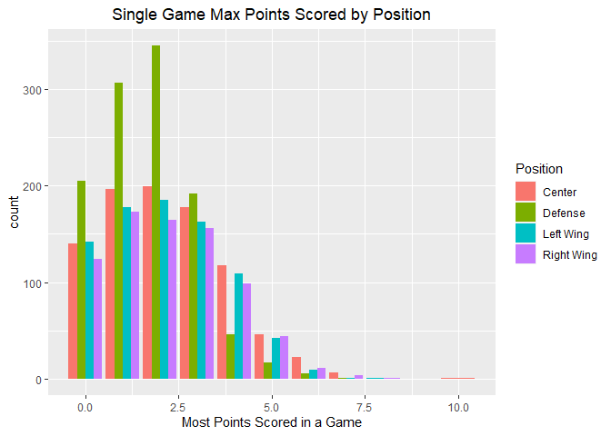
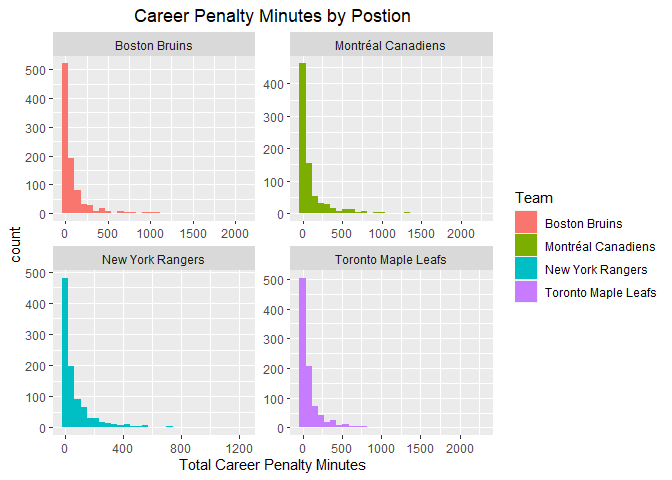
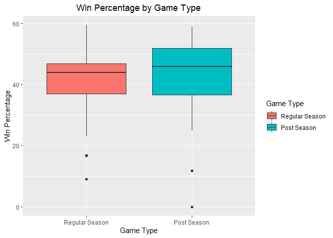
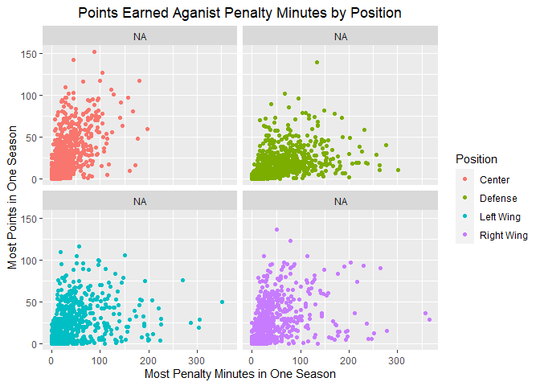
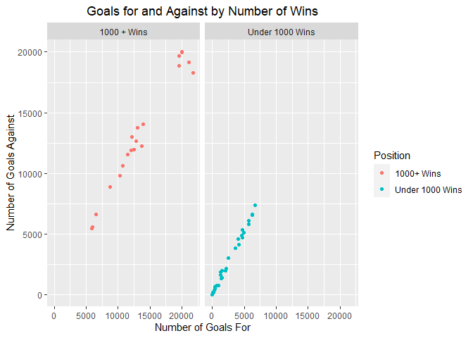

ST 558 Project 1
================
Kera Whitley
6/9/2021

-   [Base Functions](#base-functions)
    -   [Franchise Information](#franchise-information)
    -   [Franchise Totals](#franchise-totals)
    -   [Season Records](#season-records)
    -   [Goalie Records](#goalie-records)
    -   [Skater Records](#skater-records)
    -   [Franchise Details](#franchise-details)
    -   [Franchise Stats](#franchise-stats)
-   [Wrapper Function](#wrapper-function)
-   [Using the Functions](#using-the-functions)
    -   [Gathering Information](#gathering-information)
-   [Creating New Variables](#creating-new-variables)
-   [Tables and Plots](#tables-and-plots)
    -   [Contingency Tables](#contingency-tables)
    -   [Numerical Summaries](#numerical-summaries)
    -   [Plots](#plots)

# Base Functions

## Franchise Information

``` r
Franchise <- function(name = NULL){
  base_url <- "https://records.nhl.com/site/api/franchise?"
  get_franch <- GET(base_url)
  get_franch_text <- content(get_franch, as = "text", encoding = "UTF-8")
  get_franch_json <- fromJSON(get_franch_text, flatten = TRUE)
  franch.list <- as_tibble(get_franch_json$data) %>% rename(franchiseId = id)   
  #id was confirmed to be franchiseId by comparing to other API calls
  if (is.character(name)) 
    # If a team is specified, the fullname, common name, place name, abbreviation and id can all be used
    # If no team is specified all teams will be returned.
    return(franch.list %>% 
             filter(fullName == name | teamCommonName == name | teamPlaceName == name | teamAbbrev == name)) else               if (is.null(name)) return(franch.list) else
                 return(franch.list %>% filter(franchiseId == name)) 
  
  invisible()
}
```

## Franchise Totals

``` r
FranchiseTotals <- function(id = NULL){
  base_url <- "https://records.nhl.com/site/api/franchise-team-totals"
  get_franch <- GET(base_url)
  get_franch_text <- content(get_franch, as = "text", encoding = "UTF-8")
  get_franch_json <- fromJSON(get_franch_text, flatten = TRUE)
  totsList <- as_tibble(get_franch_json$data) %>% rename(teamAbbrev = triCode) %>% select(2:30) # Select all but id
  totsList$activeFranchise <- ifelse(totsList$activeFranchise == 1, TRUE, FALSE) 
  # Change activeFranchise from 1/0 to logical to match later API calls
  return(totsList)

  invisible()
}
```

## Season Records

``` r
SeasonRecords <- function(id){
  base_url <- "https://records.nhl.com/site/api/franchise-season-records?cayenneExp=franchiseId"
  full_url <- paste0(base_url, "=", id)
  get_franch <- GET(full_url)
  get_franch_text <- content(get_franch, as = "text", encoding = "UTF-8")
  get_franch_json <- fromJSON(get_franch_text, flatten = TRUE)
  totsList <- as_tibble(get_franch_json$data) %>% select(2:57) %>% rename(fullName = franchiseName)
  # Select all but id, and rename franchiseName to match other calls
  return(totsList)

  invisible()
}
```

## Goalie Records

``` r
GoalieRecords <- function(id){
  base_url <- "https://records.nhl.com/site/api/franchise-goalie-records?cayenneExp=franchiseId"
  full_url <- paste0(base_url, "=", id)
  get_franch <- GET(full_url)
  get_franch_text <- content(get_franch, as = "text", encoding = "UTF-8")
  get_franch_json <- fromJSON(get_franch_text, flatten = TRUE)
  GoalieList <- as_tibble(get_franch_json$data) %>% select(2:29) %>% rename(fullName = franchiseName)
  # Select all but id, and rename franchiseName to match other calls
  return(GoalieList)

  invisible()
}
```

## Skater Records

``` r
SkaterRecords <- function(id){
  base_url <- "https://records.nhl.com/site/api/franchise-skater-records?cayenneExp=franchiseId"
  full_url <- paste0(base_url, "=", id)
  get_franch <- GET(full_url)
  get_franch_text <- content(get_franch, as = "text", encoding = "UTF-8")
  get_franch_json <- fromJSON(get_franch_text, flatten = TRUE)
  skaterList <- as_tibble(get_franch_json$data) %>% select(2:31) %>% rename(fullName = franchiseName)
  # Select all but id, and rename franchiseName to match other calls
  return(skaterList)

  invisible()
}
```

## Franchise Details

``` r
FranchiseDetails <- function(id){
  base_url <- "https://records.nhl.com/site/api/franchise-detail?cayenneExp=mostRecentTeamId"
  full_url <- paste0(base_url, "=", id)
  get_franch <- GET(full_url)
  get_franch_text <- content(get_franch, as = "text", encoding = "UTF-8")
  get_franch_json <- fromJSON(get_franch_text, flatten = TRUE)
  detailList <- as_tibble(get_franch_json$data) %>% select(2:13) %>% 
    rename(fullName = teamFullName, activeFranchise = active)
  
  names <- colnames(detailList)
  # Four variables returned a string from HTML. The following code split it into a list
  cap <- detailList$captainHistory %>% read_xml(as_html = TRUE) %>% xml_text() %>% strsplit("\r\n\t")
  coa <- detailList$coachingHistory %>% read_xml(as_html = TRUE) %>% xml_text() %>% strsplit("\r\n\t")
  gmh <- detailList$generalManagerHistory %>% read_xml(as_html = TRUE) %>% xml_text() %>% strsplit("\r\n\t")
  rns <- detailList$retiredNumbersSummary %>% read_xml(as_html = TRUE) %>% xml_text() %>% strsplit("\r\n\t")

  # The same code was run for each of the four of the above new variables to create four separate data sets
  a <- as.data.frame(matrix(rep(detailList), nrow = length(cap[[1]]), ncol = length(detailList), byrow = TRUE))
  for (i in 1:length(cap[[1]])){
    a[[2]][i] <- cap[[1]][i]
  }
  CaptainDetails <- as_tibble(a) 
  colnames(CaptainDetails) <- names
  CaptainDetails <- CaptainDetails %>% select(!contains(c("coach", "general", "retired")))
  CaptainDetails <- CaptainDetails %>% unnest(c(activeFranchise, captainHistory, dateAwarded, directoryUrl,
                                                firstSeasonId, heroImageUrl, mostRecentTeamId, teamAbbrev,
                                                fullName))
  
  a <- as.data.frame(matrix(rep(detailList), nrow = length(coa[[1]]), ncol = length(detailList), byrow = TRUE))
  for (i in 1:length(coa[[1]])){
    a[[3]][i] <- coa[[1]][i]
  }
  CoachDetails <- as_tibble(a)
  colnames(CoachDetails) <- names
  CoachDetails <- CoachDetails %>% select(!contains(c("captain", "general", "retired")))
  CoachDetails <- CoachDetails %>% unnest(c(activeFranchise, coachingHistory, dateAwarded, directoryUrl,
                                            firstSeasonId, heroImageUrl, mostRecentTeamId, teamAbbrev, fullName))
  
  a <- as.data.frame(matrix(rep(detailList), nrow = length(gmh[[1]]), ncol = length(detailList), byrow = TRUE))
  for (i in 1:length(gmh[[1]])){
    a[[7]][i] <- gmh[[1]][i]
  }
  GMDetails <- as_tibble(a)
  colnames(GMDetails) <- names
  GMDetails <- GMDetails %>% select(!contains(c("captain", "coach", "retired")))
  GMDetails <- GMDetails %>% unnest(c(activeFranchise, dateAwarded, directoryUrl, firstSeasonId,
                                      generalManagerHistory, heroImageUrl, mostRecentTeamId, teamAbbrev, fullName))
  
  a <- as.data.frame(matrix(rep(detailList), nrow = length(rns[[1]]), ncol = length(detailList), byrow = TRUE))
  for (i in 1:length(rns[[1]])){
    a[[10]][i] <- rns[[1]][i]
  }
  RetiredDetails <- as_tibble(a)
  colnames(RetiredDetails) <- names
  RetiredDetails <- RetiredDetails %>% select(!contains(c("captain", "coach", "general")))
  RetiredDetails <- RetiredDetails %>% unnest(c(activeFranchise, dateAwarded, directoryUrl, firstSeasonId,
                                                heroImageUrl, mostRecentTeamId, retiredNumbersSummary, teamAbbrev,
                                                fullName))
  
  # The four newly created datasets were returned separately as they all have potentially different 
  # numbers of observations
  return(list(CaptainDetails = CaptainDetails, CoachDetails = CoachDetails, GMDetails = GMDetails,
              RetiredDetails = RetiredDetails))

  invisible()
}
```

## Franchise Stats

``` r
TeamStats <- function(name = NULL){
  base_url <- "https://statsapi.web.nhl.com/api/v1/teams"
  if (is.null(name)) full_url <- paste0(base_url, "?expand=team.stats") else
    full_url <- paste0(base_url, "/", name, "?expand=team.stats")
  get_stats <- GET(full_url)
  get_stats_text <- content(get_stats, as = "text", encoding = "UTF-8")
  get_stats_json <- fromJSON(get_stats_text, flatten = TRUE)
  TeamList <- as_tibble(get_stats_json$teams) %>% 
    select(!(contains(c("link", "Url", "franchise.", "short"))), -1) %>% 
    rename(teamAbbrev = abbreviation, teamCommonName = teamName, teamPlaceName = locationName,
           fullName = name) # Rename was used to match other API call variable names
  Season <- TeamList %>% unnest(teamStats)
  
  # Season is used and unnested twice, once for the stats numbers and once for the rankings
  StatsNums <-Season %>% unnest(splits) %>% filter(!is.na(stat.gamesPlayed)) 
  # Converting the stats numbers to numerics for computation later. This isn't done for ranks.
  Stats <- StatsNums %>% select(starts_with(c("stat", "first"))) %>% mutate_if(is.character, as.numeric)
  Franch <- Season %>% select(1:4, 7:22)
  StatsNums <- cbind(Franch, Stats)
  StatsRank <- Season %>% unnest(splits) %>% filter(is.na(stat.gamesPlayed))

  return(list(StatsNumbers = StatsNums, StatsRank = StatsRank))

  invisible()
}
```

# Wrapper Function

Here, franchise is always called so that the name can be converted to an
ID number for the other API calls and the numbers should always be up to
date. If no team was designated in name, then the Montreal Canadiens
will be returned for all functions that only output one team.

``` r
StatsNHL <- function(data, name = NULL){

  fran1 <- Franchise(name)

  if (data == "franch") return(fran1) else
    if (data == "totals") return(FranchiseTotals(id = fran1$franchiseId)) else
      if (data == "seas.records") return(SeasonRecords(id = fran1$franchiseId[1])) else
        if (data == "g.records") return(GoalieRecords(id = fran1$franchiseId[1])) else
          if (data == "s.records") return(SkaterRecords(id = fran1$franchiseId[1])) else 
            if (data == "deets") return(FranchiseDetails(id = fran1$mostRecentTeamId[1])) else
              if (is.null(name) & data == "stats") return(TeamStats(name)) else
                if (data == "stats") return(TeamStats(name = fran1$mostRecentTeamId[1])) else
                  return("Please use keywords 'franch', 'totals', 'seas.records', 'g.records', 's.records',
                         'deets', or 'stats'")

  invisible()
  
}

# How to call each of the functions in the wrapper with different ways to call for different teams.
StatsNHL(data = "franch")
```

    ## # A tibble: 39 x 8
    ##    franchiseId firstSeasonId fullName             lastSeasonId mostRecentTeamId teamAbbrev teamCommonName teamPlaceName
    ##          <int>         <int> <chr>                       <int>            <int> <chr>      <chr>          <chr>        
    ##  1           1      19171918 Montréal Canadiens             NA                8 MTL        Canadiens      Montréal     
    ##  2           2      19171918 Montreal Wanderers       19171918               41 MWN        Wanderers      Montreal     
    ##  3           3      19171918 St. Louis Eagles         19341935               45 SLE        Eagles         St. Louis    
    ##  4           4      19191920 Hamilton Tigers          19241925               37 HAM        Tigers         Hamilton     
    ##  5           5      19171918 Toronto Maple Leafs            NA               10 TOR        Maple Leafs    Toronto      
    ##  6           6      19241925 Boston Bruins                  NA                6 BOS        Bruins         Boston       
    ##  7           7      19241925 Montreal Maroons         19371938               43 MMR        Maroons        Montreal     
    ##  8           8      19251926 Brooklyn Americans       19411942               51 BRK        Americans      Brooklyn     
    ##  9           9      19251926 Philadelphia Quakers     19301931               39 QUA        Quakers        Philadelphia 
    ## 10          10      19261927 New York Rangers               NA                3 NYR        Rangers        New York     
    ## # ... with 29 more rows

``` r
StatsNHL("totals")
```

    ## # A tibble: 105 x 29
    ##    activeFranchise firstSeasonId franchiseId gameTypeId gamesPlayed goalsAgainst goalsFor homeLosses homeOvertimeLosses
    ##    <lgl>                   <int>       <int>      <int>       <int>        <int>    <int>      <int>              <int>
    ##  1 TRUE                 19821983          23          2        2993         8902     8792        525                 85
    ##  2 TRUE                 19821983          23          3         257          634      697         53                  0
    ##  3 TRUE                 19721973          22          2        3788        11907    12045        678                 84
    ##  4 TRUE                 19721973          22          3         310          899      986         53                  1
    ##  5 TRUE                 19261927          10          2        6560        20020    20041       1143                 76
    ##  6 TRUE                 19261927          10          3         518         1447     1404        104                  0
    ##  7 TRUE                 19671968          16          3         449         1332     1335         97                  0
    ##  8 TRUE                 19671968          16          2        4171        12255    13690        584                 93
    ##  9 TRUE                 19671968          17          2        4171        14049    13874        683                 60
    ## 10 TRUE                 19671968          17          3         391         1131     1190         85                  0
    ## # ... with 95 more rows, and 20 more variables: homeTies <int>, homeWins <int>, lastSeasonId <int>, losses <int>,
    ## #   overtimeLosses <int>, penaltyMinutes <int>, pointPctg <dbl>, points <int>, roadLosses <int>,
    ## #   roadOvertimeLosses <int>, roadTies <int>, roadWins <int>, shootoutLosses <int>, shootoutWins <int>,
    ## #   shutouts <int>, teamId <int>, teamName <chr>, ties <int>, teamAbbrev <chr>, wins <int>

``` r
StatsNHL("seas.records", name = "New York")
```

    ## # A tibble: 1 x 56
    ##   fewestGoals fewestGoalsAgainst fewestGoalsAgainstSeas~ fewestGoalsSeaso~ fewestLosses fewestLossesSeaso~ fewestPoints
    ##         <int>              <int> <chr>                   <chr>                    <int> <chr>                     <int>
    ## 1         150                177 1970-71 (78)            1954-55 (70)                17 1971-72 (78)                 47
    ## # ... with 49 more variables: fewestPointsSeasons <chr>, fewestTies <int>, fewestTiesSeasons <chr>, fewestWins <int>,
    ## #   fewestWinsSeasons <chr>, franchiseId <int>, fullName <chr>, homeLossStreak <int>, homeLossStreakDates <chr>,
    ## #   homePointStreak <int>, homePointStreakDates <chr>, homeWinStreak <int>, homeWinStreakDates <chr>,
    ## #   homeWinlessStreak <int>, homeWinlessStreakDates <chr>, lossStreak <int>, lossStreakDates <chr>,
    ## #   mostGameGoals <int>, mostGameGoalsDates <chr>, mostGoals <int>, mostGoalsAgainst <int>,
    ## #   mostGoalsAgainstSeasons <chr>, mostGoalsSeasons <chr>, mostLosses <int>, mostLossesSeasons <chr>,
    ## #   mostPenaltyMinutes <int>, mostPenaltyMinutesSeasons <chr>, mostPoints <int>, mostPointsSeasons <chr>,
    ## #   mostShutouts <int>, mostShutoutsSeasons <chr>, mostTies <int>, mostTiesSeasons <chr>, mostWins <int>,
    ## #   mostWinsSeasons <chr>, pointStreak <int>, pointStreakDates <chr>, roadLossStreak <int>, roadLossStreakDates <chr>,
    ## #   roadPointStreak <int>, roadPointStreakDates <chr>, roadWinStreak <int>, roadWinStreakDates <chr>,
    ## #   roadWinlessStreak <int>, roadWinlessStreakDates <chr>, winStreak <int>, winStreakDates <chr>, winlessStreak <int>,
    ## #   winlessStreakDates <chr>

``` r
StatsNHL("g.records", name = 3)
```

    ## # A tibble: 4 x 28
    ##   activePlayer firstName franchiseId fullName  gameTypeId gamesPlayed lastName losses mostGoalsAgains~ mostGoalsAgains~
    ##   <lgl>        <chr>           <int> <chr>          <int>       <int> <chr>     <int> <chr>                       <int>
    ## 1 FALSE        Clint               3 St. Loui~          2         158 Benedict     58 1917-12-22                     11
    ## 2 FALSE        Bill                3 St. Loui~          2          90 Beverid~     56 1934-12-13                     11
    ## 3 FALSE        Alec                3 St. Loui~          2         294 Connell     106 1925-02-11                     10
    ## 4 FALSE        Sammy               3 St. Loui~          2           2 Hebert        1 1924-03-01                      5
    ## # ... with 18 more variables: mostSavesDates <lgl>, mostSavesOneGame <lgl>, mostShotsAgainstDates <lgl>,
    ## #   mostShotsAgainstOneGame <lgl>, mostShutoutsOneSeason <int>, mostShutoutsSeasonIds <chr>, mostWinsOneSeason <int>,
    ## #   mostWinsSeasonIds <chr>, overtimeLosses <lgl>, playerId <int>, positionCode <chr>, rookieGamesPlayed <int>,
    ## #   rookieShutouts <int>, rookieWins <int>, seasons <int>, shutouts <int>, ties <int>, wins <int>

``` r
StatsNHL("s.records", name = "BOS")
```

    ## # A tibble: 918 x 30
    ##    activePlayer assists firstName franchiseId fullName  gameTypeId gamesPlayed goals lastName mostAssistsGameDates     
    ##    <lgl>          <int> <chr>           <int> <chr>          <int>       <int> <int> <chr>    <chr>                    
    ##  1 FALSE              0 Rick                6 Boston B~          2           1     0 Adduono  1975-10-09, 1975-10-12, ~
    ##  2 FALSE              1 John                6 Boston B~          2           6     0 Arbour   1968-01-21               
    ##  3 FALSE              3 Barry               6 Boston B~          2          14     0 Ashbee   1965-11-25, 1965-12-01, ~
    ##  4 FALSE              0 Steve               6 Boston B~          2           1     0 Atkinson 1968-10-11, 1968-10-13, ~
    ##  5 FALSE              2 Murray              6 Boston B~          2          15     0 Balfour  1964-10-17, 1964-11-01   
    ##  6 FALSE              0 Stan                6 Boston B~          2           7     0 Baluik   1959-10-08, 1959-10-10, ~
    ##  7 FALSE              2 Bobby               6 Boston B~          2           8     0 Benson   1925-01-10, 1925-01-24   
    ##  8 FALSE              0 Fred                6 Boston B~          2           2     0 Bergdin~ 1925-11-26, 1925-11-28, ~
    ##  9 FALSE              0 Phil                6 Boston B~          2           8     0 Besler   1935-11-16, 1935-11-19, ~
    ## 10 FALSE              5 Don                 6 Boston B~          2           6     0 Blackbu~ 1963-01-10               
    ## # ... with 908 more rows, and 20 more variables: mostAssistsOneGame <int>, mostAssistsOneSeason <int>,
    ## #   mostAssistsSeasonIds <chr>, mostGoalsGameDates <chr>, mostGoalsOneGame <int>, mostGoalsOneSeason <int>,
    ## #   mostGoalsSeasonIds <chr>, mostPenaltyMinutesOneSeason <int>, mostPenaltyMinutesSeasonIds <chr>,
    ## #   mostPointsGameDates <chr>, mostPointsOneGame <int>, mostPointsOneSeason <int>, mostPointsSeasonIds <chr>,
    ## #   penaltyMinutes <int>, playerId <int>, points <int>, positionCode <chr>, rookieGamesPlayed <int>,
    ## #   rookiePoints <int>, seasons <int>

``` r
StatsNHL("deets")
```

    ## $CaptainDetails
    ## # A tibble: 31 x 9
    ##    activeFranchise captainHistory   dateAwarded  directoryUrl  firstSeasonId heroImageUrl   mostRecentTeamId teamAbbrev
    ##    <lgl>           <chr>            <chr>        <chr>                 <int> <chr>                     <int> <chr>     
    ##  1 TRUE            Shea Weber: 201~ 1917-11-26T~ https://www.~      19171918 https://recor~                8 MTL       
    ##  2 TRUE            Max Pacioretty:~ 1917-11-26T~ https://www.~      19171918 https://recor~                8 MTL       
    ##  3 TRUE            (No Captain): 2~ 1917-11-26T~ https://www.~      19171918 https://recor~                8 MTL       
    ##  4 TRUE            Brian Gionta: 2~ 1917-11-26T~ https://www.~      19171918 https://recor~                8 MTL       
    ##  5 TRUE            (No Captain): 2~ 1917-11-26T~ https://www.~      19171918 https://recor~                8 MTL       
    ##  6 TRUE            Saku Koivu: 199~ 1917-11-26T~ https://www.~      19171918 https://recor~                8 MTL       
    ##  7 TRUE            Vincent Damphou~ 1917-11-26T~ https://www.~      19171918 https://recor~                8 MTL       
    ##  8 TRUE            Pierre Turgeon ~ 1917-11-26T~ https://www.~      19171918 https://recor~                8 MTL       
    ##  9 TRUE            Mike Keane and ~ 1917-11-26T~ https://www.~      19171918 https://recor~                8 MTL       
    ## 10 TRUE            Kirk Muller and~ 1917-11-26T~ https://www.~      19171918 https://recor~                8 MTL       
    ## # ... with 21 more rows, and 1 more variable: fullName <chr>
    ## 
    ## $CoachDetails
    ## # A tibble: 36 x 9
    ##    activeFranchise coachingHistory   dateAwarded directoryUrl  firstSeasonId heroImageUrl   mostRecentTeamId teamAbbrev
    ##    <lgl>           <chr>             <chr>       <chr>                 <int> <chr>                     <int> <chr>     
    ##  1 TRUE            Dominique Duchar~ 1917-11-26~ https://www.~      19171918 https://recor~                8 MTL       
    ##  2 TRUE            Claude Julien: F~ 1917-11-26~ https://www.~      19171918 https://recor~                8 MTL       
    ##  3 TRUE            Michel Therrien:~ 1917-11-26~ https://www.~      19171918 https://recor~                8 MTL       
    ##  4 TRUE            Randy Cunneywort~ 1917-11-26~ https://www.~      19171918 https://recor~                8 MTL       
    ##  5 TRUE            Jacques Martin: ~ 1917-11-26~ https://www.~      19171918 https://recor~                8 MTL       
    ##  6 TRUE            Bob Gainey: Marc~ 1917-11-26~ https://www.~      19171918 https://recor~                8 MTL       
    ##  7 TRUE            Guy Carbonneau: ~ 1917-11-26~ https://www.~      19171918 https://recor~                8 MTL       
    ##  8 TRUE            Bob Gainey: Jan.~ 1917-11-26~ https://www.~      19171918 https://recor~                8 MTL       
    ##  9 TRUE            Claude Julien: J~ 1917-11-26~ https://www.~      19171918 https://recor~                8 MTL       
    ## 10 TRUE            Michel Therrien:~ 1917-11-26~ https://www.~      19171918 https://recor~                8 MTL       
    ## # ... with 26 more rows, and 1 more variable: fullName <chr>
    ## 
    ## $GMDetails
    ## # A tibble: 16 x 9
    ##    activeFranchise dateAwarded  directoryUrl  firstSeasonId generalManagerHi~ heroImageUrl  mostRecentTeamId teamAbbrev
    ##    <lgl>           <chr>        <chr>                 <int> <chr>             <chr>                    <int> <chr>     
    ##  1 TRUE            1917-11-26T~ https://www.~      19171918 "Marc Bergevin: ~ https://reco~                8 MTL       
    ##  2 TRUE            1917-11-26T~ https://www.~      19171918 "Pierre Gauthier~ https://reco~                8 MTL       
    ##  3 TRUE            1917-11-26T~ https://www.~      19171918 "Bob Gainey: Jun~ https://reco~                8 MTL       
    ##  4 TRUE            1917-11-26T~ https://www.~      19171918 "Andre Savard: N~ https://reco~                8 MTL       
    ##  5 TRUE            1917-11-26T~ https://www.~      19171918 "Rejean Houle: O~ https://reco~                8 MTL       
    ##  6 TRUE            1917-11-26T~ https://www.~      19171918 "Serge Savard: A~ https://reco~                8 MTL       
    ##  7 TRUE            1917-11-26T~ https://www.~      19171918 "Irving Grundman~ https://reco~                8 MTL       
    ##  8 TRUE            1917-11-26T~ https://www.~      19171918 "Sam Pollock: Ma~ https://reco~                8 MTL       
    ##  9 TRUE            1917-11-26T~ https://www.~      19171918 "Frank Selke: Ju~ https://reco~                8 MTL       
    ## 10 TRUE            1917-11-26T~ https://www.~      19171918 "Tommy Gorman: A~ https://reco~                8 MTL       
    ## 11 TRUE            1917-11-26T~ https://www.~      19171918 "Jules Dugal: Ja~ https://reco~                8 MTL       
    ## 12 TRUE            1917-11-26T~ https://www.~      19171918 "Cecil Hart: Jul~ https://reco~                8 MTL       
    ## 13 TRUE            1917-11-26T~ https://www.~      19171918 "Ernest Savard: ~ https://reco~                8 MTL       
    ## 14 TRUE            1917-11-26T~ https://www.~      19171918 "Leo Dandurand: ~ https://reco~                8 MTL       
    ## 15 TRUE            1917-11-26T~ https://www.~      19171918 "George Kennedy:~ https://reco~                8 MTL       
    ## 16 TRUE            1917-11-26T~ https://www.~      19171918 "* Date range in~ https://reco~                8 MTL       
    ## # ... with 1 more variable: fullName <chr>
    ## 
    ## $RetiredDetails
    ## # A tibble: 18 x 9
    ##    activeFranchise dateAwarded  directoryUrl  firstSeasonId heroImageUrl   mostRecentTeamId retiredNumbersS~ teamAbbrev
    ##    <lgl>           <chr>        <chr>                 <int> <chr>                     <int> <chr>            <chr>     
    ##  1 TRUE            1917-11-26T~ https://www.~      19171918 https://recor~                8 "1 – Jacques Pl~ MTL       
    ##  2 TRUE            1917-11-26T~ https://www.~      19171918 https://recor~                8 "2 – Doug Harve~ MTL       
    ##  3 TRUE            1917-11-26T~ https://www.~      19171918 https://recor~                8 "3 – Butch Bouc~ MTL       
    ##  4 TRUE            1917-11-26T~ https://www.~      19171918 https://recor~                8 "4 – Jean Beliv~ MTL       
    ##  5 TRUE            1917-11-26T~ https://www.~      19171918 https://recor~                8 "5 – Bernie Geo~ MTL       
    ##  6 TRUE            1917-11-26T~ https://www.~      19171918 https://recor~                8 "5 – Guy Lapoin~ MTL       
    ##  7 TRUE            1917-11-26T~ https://www.~      19171918 https://recor~                8 "7 – Howie More~ MTL       
    ##  8 TRUE            1917-11-26T~ https://www.~      19171918 https://recor~                8 "9 – Maurice Ri~ MTL       
    ##  9 TRUE            1917-11-26T~ https://www.~      19171918 https://recor~                8 "10 – Guy Lafle~ MTL       
    ## 10 TRUE            1917-11-26T~ https://www.~      19171918 https://recor~                8 "12 – Dickie Mo~ MTL       
    ## 11 TRUE            1917-11-26T~ https://www.~      19171918 https://recor~                8 "12 – Yvan Cour~ MTL       
    ## 12 TRUE            1917-11-26T~ https://www.~      19171918 https://recor~                8 "16 – Elmer Lac~ MTL       
    ## 13 TRUE            1917-11-26T~ https://www.~      19171918 https://recor~                8 "16 – Henri Ric~ MTL       
    ## 14 TRUE            1917-11-26T~ https://www.~      19171918 https://recor~                8 "18 – Serge Sav~ MTL       
    ## 15 TRUE            1917-11-26T~ https://www.~      19171918 https://recor~                8 "19 – Larry Rob~ MTL       
    ## 16 TRUE            1917-11-26T~ https://www.~      19171918 https://recor~                8 "23 – Bob Gaine~ MTL       
    ## 17 TRUE            1917-11-26T~ https://www.~      19171918 https://recor~                8 "29 – Ken Dryde~ MTL       
    ## 18 TRUE            1917-11-26T~ https://www.~      19171918 https://recor~                8 "33 – Patrick R~ MTL       
    ## # ... with 1 more variable: fullName <chr>

``` r
StatsNHL("stats")
```

    ## $StatsNumbers
    ##               fullName teamAbbrev teamCommonName teamPlaceName  type.displayName type.gameType.id
    ## 1    New Jersey Devils        NJD         Devils    New Jersey statsSingleSeason                R
    ## 2   New York Islanders        NYI      Islanders      New York statsSingleSeason                R
    ## 3     New York Rangers        NYR        Rangers      New York statsSingleSeason                R
    ## 4  Philadelphia Flyers        PHI         Flyers  Philadelphia statsSingleSeason                R
    ## 5  Pittsburgh Penguins        PIT       Penguins    Pittsburgh statsSingleSeason                R
    ## 6        Boston Bruins        BOS         Bruins        Boston statsSingleSeason                R
    ## 7       Buffalo Sabres        BUF         Sabres       Buffalo statsSingleSeason                R
    ## 8   Montréal Canadiens        MTL      Canadiens      Montréal statsSingleSeason                R
    ## 9      Ottawa Senators        OTT       Senators        Ottawa statsSingleSeason                R
    ## 10 Toronto Maple Leafs        TOR    Maple Leafs       Toronto statsSingleSeason                R
    ## 11 Carolina Hurricanes        CAR     Hurricanes      Carolina statsSingleSeason                R
    ## 12    Florida Panthers        FLA       Panthers       Florida statsSingleSeason                R
    ## 13 Tampa Bay Lightning        TBL      Lightning     Tampa Bay statsSingleSeason                R
    ## 14 Washington Capitals        WSH       Capitals    Washington statsSingleSeason                R
    ## 15  Chicago Blackhawks        CHI     Blackhawks       Chicago statsSingleSeason                R
    ## 16   Detroit Red Wings        DET      Red Wings       Detroit statsSingleSeason                R
    ## 17 Nashville Predators        NSH      Predators     Nashville statsSingleSeason                R
    ## 18     St. Louis Blues        STL          Blues     St. Louis statsSingleSeason                R
    ## 19      Calgary Flames        CGY         Flames       Calgary statsSingleSeason                R
    ##    type.gameType.description type.gameType.postseason franchiseId active                        venue.name
    ## 1             Regular season                    FALSE          23   TRUE                 Prudential Center
    ## 2             Regular season                    FALSE          22   TRUE Nassau Veterans Memorial Coliseum
    ## 3             Regular season                    FALSE          10   TRUE             Madison Square Garden
    ## 4             Regular season                    FALSE          16   TRUE                Wells Fargo Center
    ## 5             Regular season                    FALSE          17   TRUE                  PPG Paints Arena
    ## 6             Regular season                    FALSE           6   TRUE                         TD Garden
    ## 7             Regular season                    FALSE          19   TRUE                    KeyBank Center
    ## 8             Regular season                    FALSE           1   TRUE                       Bell Centre
    ## 9             Regular season                    FALSE          30   TRUE              Canadian Tire Centre
    ## 10            Regular season                    FALSE           5   TRUE                  Scotiabank Arena
    ## 11            Regular season                    FALSE          26   TRUE                         PNC Arena
    ## 12            Regular season                    FALSE          33   TRUE                       BB&T Center
    ## 13            Regular season                    FALSE          31   TRUE                      AMALIE Arena
    ## 14            Regular season                    FALSE          24   TRUE                 Capital One Arena
    ## 15            Regular season                    FALSE          11   TRUE                     United Center
    ## 16            Regular season                    FALSE          12   TRUE              Little Caesars Arena
    ## 17            Regular season                    FALSE          34   TRUE                 Bridgestone Arena
    ## 18            Regular season                    FALSE          18   TRUE                 Enterprise Center
    ## 19            Regular season                    FALSE          21   TRUE             Scotiabank Saddledome
    ##      venue.city venue.id venue.timeZone.id venue.timeZone.offset venue.timeZone.tz division.id    division.name
    ## 1        Newark       NA  America/New_York                    -4               EDT          25  MassMutual East
    ## 2     Uniondale       NA  America/New_York                    -4               EDT          25  MassMutual East
    ## 3      New York     5054  America/New_York                    -4               EDT          25  MassMutual East
    ## 4  Philadelphia     5096  America/New_York                    -4               EDT          25  MassMutual East
    ## 5    Pittsburgh     5034  America/New_York                    -4               EDT          25  MassMutual East
    ## 6        Boston     5085  America/New_York                    -4               EDT          25  MassMutual East
    ## 7       Buffalo     5039  America/New_York                    -4               EDT          25  MassMutual East
    ## 8      Montréal     5028  America/Montreal                    -4               EDT          28     Scotia North
    ## 9        Ottawa     5031  America/New_York                    -4               EDT          28     Scotia North
    ## 10      Toronto       NA   America/Toronto                    -4               EDT          28     Scotia North
    ## 11      Raleigh     5066  America/New_York                    -4               EDT          26 Discover Central
    ## 12      Sunrise     5027  America/New_York                    -4               EDT          26 Discover Central
    ## 13        Tampa       NA  America/New_York                    -4               EDT          26 Discover Central
    ## 14   Washington     5094  America/New_York                    -4               EDT          25  MassMutual East
    ## 15      Chicago     5092   America/Chicago                    -5               CDT          26 Discover Central
    ## 16      Detroit     5145   America/Detroit                    -4               EDT          26 Discover Central
    ## 17    Nashville     5030   America/Chicago                    -5               CDT          26 Discover Central
    ## 18    St. Louis     5076   America/Chicago                    -5               CDT          27       Honda West
    ## 19      Calgary     5075    America/Denver                    -6               MDT          28     Scotia North
    ##    conference.id conference.name stat.gamesPlayed stat.wins stat.losses stat.ot stat.pts stat.ptPctg stat.goalsPerGame
    ## 1              6         Eastern               56        19          30       7       45        40.2             2.589
    ## 2              6         Eastern               56        32          17       7       71        63.4             2.714
    ## 3              6         Eastern               56        27          23       6       60        53.6             3.143
    ## 4              6         Eastern               56        25          23       8       58        51.8             2.857
    ## 5              6         Eastern               56        37          16       3       77        68.8             3.446
    ## 6              6         Eastern               56        33          16       7       73        65.2             2.929
    ## 7              6         Eastern               56        15          34       7       37        33.0             2.393
    ## 8              6         Eastern               56        24          21      11       59        52.7             2.821
    ## 9              6         Eastern               56        23          28       5       51        45.5             2.768
    ## 10             6         Eastern               56        35          14       7       77        68.8             3.321
    ## 11             6         Eastern               56        36          12       8       80        71.4             3.125
    ## 12             6         Eastern               56        37          14       5       79        70.5             3.357
    ## 13             6         Eastern               56        36          17       3       75        67.0             3.214
    ## 14             6         Eastern               56        36          15       5       77        68.8             3.357
    ## 15             5         Western               56        24          25       7       55        49.1             2.839
    ## 16             6         Eastern               56        19          27      10       48        42.9             2.232
    ## 17             5         Western               56        31          23       2       64        57.1             2.696
    ## 18             5         Western               56        27          20       9       63        56.3             2.982
    ## 19             5         Western               56        26          27       3       55        49.1             2.768
    ##    stat.goalsAgainstPerGame stat.evGGARatio stat.powerPlayPercentage stat.powerPlayGoals stat.powerPlayGoalsAgainst
    ## 1                     3.375          0.8293                     14.2                  22                         43
    ## 2                     2.232          1.2418                     18.8                  27                         22
    ## 3                     2.768          1.0943                     20.7                  37                         30
    ## 4                     3.518          0.8060                     19.2                  32                         45
    ## 5                     2.768          1.2700                     23.7                  36                         35
    ## 6                     2.393          1.1383                     21.9                  35                         25
    ## 7                     3.500          0.6350                     21.0                  30                         31
    ## 8                     2.946          1.0291                     19.2                  29                         37
    ## 9                     3.375          0.8030                     15.5                  27                         36
    ## 10                    2.643          1.3750                     20.0                  31                         31
    ## 11                    2.393          1.3086                     25.6                  42                         26
    ## 12                    2.696          1.2553                     20.5                  39                         34
    ## 13                    2.589          1.1443                     22.2                  40                         29
    ## 14                    2.875          1.2336                     24.8                  38                         26
    ## 15                    3.286          0.8000                     21.7                  38                         35
    ## 16                    3.000          0.7768                     11.4                  17                         33
    ## 17                    2.750          1.1429                     17.6                  28                         42
    ## 18                    2.982          0.9273                     23.2                  36                         38
    ## 19                    2.857          1.0667                     18.3                  32                         34
    ##    stat.powerPlayOpportunities stat.penaltyKillPercentage stat.shotsPerGame stat.shotsAllowed stat.winScoreFirst
    ## 1                          155                       71.0           28.7857           31.0179              0.552
    ## 2                          144                       83.7           28.9821           28.3929              0.821
    ## 3                          179                       82.2           28.6964           29.7143              0.700
    ## 4                          167                       73.0           30.2143           29.2143              0.609
    ## 5                          152                       77.4           30.0714           29.9821              0.793
    ## 6                          160                       86.0           33.3214           27.0714              0.735
    ## 7                          143                       77.7           28.4286           33.7321              0.421
    ## 8                          151                       78.5           31.1786           28.1964              0.613
    ## 9                          174                       79.0           29.6964           32.1250              0.667
    ## 10                         155                       78.5           31.2679           27.8214              0.735
    ## 11                         164                       85.2           32.0357           28.2321              0.735
    ## 12                         190                       79.8           34.8929           30.0357              0.714
    ## 13                         180                       84.2           30.2143           28.2679              0.786
    ## 14                         153                       84.0           29.4107           28.7857              0.750
    ## 15                         175                       76.8           29.1964           33.7143              0.630
    ## 16                         149                       78.7           27.2857           31.8929              0.500
    ## 17                         159                       75.6           29.9821           31.3036              0.720
    ## 18                         155                       77.8           28.9643           29.8214              0.565
    ## 19                         175                       80.2           30.1607           28.1607              0.741
    ##    stat.winOppScoreFirst stat.winLeadFirstPer stat.winLeadSecondPer stat.winOutshootOpp stat.winOutshotByOpp
    ## 1                  0.111                0.737                 0.733               0.211                0.417
    ## 2                  0.321                0.833                 0.842               0.690                0.440
    ## 3                  0.231                0.739                 0.808               0.545                0.484
    ## 4                  0.333                0.769                 0.833               0.441                0.455
    ## 5                  0.519                0.846                 0.926               0.655                0.680
    ## 6                  0.364                0.909                 0.885               0.615                0.467
    ## 7                  0.189                0.364                 0.667               0.357                0.244
    ## 8                  0.200                0.700                 0.900               0.485                0.318
    ## 9                  0.219                0.867                 0.850               0.409                0.452
    ## 10                 0.455                0.692                 0.800               0.559                0.750
    ## 11                 0.500                0.810                 0.862               0.639                0.632
    ## 12                 0.607                0.737                 0.929               0.622                0.750
    ## 13                 0.500                0.909                 1.000               0.655                0.640
    ## 14                 0.500                0.727                 0.929               0.677                0.545
    ## 15                 0.241                0.647                 0.789               0.450                0.412
    ## 16                 0.219                0.643                 0.833               0.318                0.353
    ## 17                 0.419                0.750                 0.895               0.571                0.519
    ## 18                 0.424                0.696                 0.800               0.500                0.467
    ## 19                 0.207                0.737                 0.957               0.471                0.429
    ##    stat.faceOffsTaken stat.faceOffsWon stat.faceOffsLost stat.faceOffWinPercentage stat.shootingPctg stat.savePctg
    ## 1                3180             1481              1699                      46.6               9.0         0.891
    ## 2                2916             1498              1418                      51.4               9.4         0.921
    ## 3                3026             1346              1680                      44.5              11.0         0.907
    ## 4                3217             1738              1479                      54.0               9.5         0.880
    ## 5                3191             1573              1618                      49.3              11.5         0.908
    ## 6                3169             1751              1418                      55.2               8.8         0.912
    ## 7                3053             1514              1539                      49.6               8.4         0.896
    ## 8                3114             1507              1607                      48.4               9.0         0.896
    ## 9                3100             1469              1631                      47.4               9.3         0.895
    ## 10               2981             1523              1458                      51.1              10.6         0.905
    ## 11               3425             1845              1580                      53.9               9.8         0.915
    ## 12               3330             1671              1659                      50.2               9.6         0.910
    ## 13               3127             1567              1560                      50.1              10.6         0.908
    ## 14               3134             1542              1592                      49.2              11.4         0.900
    ## 15               3105             1439              1666                      46.3               9.7         0.903
    ## 16               3041             1523              1518                      50.1               8.2         0.906
    ## 17               3149             1628              1521                      51.7               9.0         0.912
    ## 18               3145             1677              1468                      53.3              10.3         0.900
    ## 19               3085             1541              1544                      50.0               9.2         0.899
    ##    stat.penaltyKillOpportunities stat.savePctRank stat.shootingPctRank firstYearOfPlay
    ## 1                             NA               NA                   NA            1982
    ## 2                             NA               NA                   NA            1972
    ## 3                             NA               NA                   NA            1926
    ## 4                             NA               NA                   NA            1967
    ## 5                             NA               NA                   NA            1967
    ## 6                             NA               NA                   NA            1924
    ## 7                             NA               NA                   NA            1970
    ## 8                             NA               NA                   NA            1909
    ## 9                             NA               NA                   NA            1990
    ## 10                            NA               NA                   NA            1917
    ## 11                            NA               NA                   NA            1979
    ## 12                            NA               NA                   NA            1993
    ## 13                            NA               NA                   NA            1991
    ## 14                            NA               NA                   NA            1974
    ## 15                            NA               NA                   NA            1926
    ## 16                            NA               NA                   NA            1926
    ## 17                            NA               NA                   NA            1997
    ## 18                            NA               NA                   NA            1967
    ## 19                            NA               NA                   NA            1980
    ##  [ reached 'max' / getOption("max.print") -- omitted 12 rows ]
    ## 
    ## $StatsRank
    ## # A tibble: 31 x 55
    ##    fullName      teamAbbrev teamCommonName teamPlaceName firstYearOfPlay stat.gamesPlayed stat.wins stat.losses stat.ot
    ##    <chr>         <chr>      <chr>          <chr>         <chr>                      <int> <chr>     <chr>       <chr>  
    ##  1 New Jersey D~ NJD        Devils         New Jersey    1982                          NA 28th      29th        15th   
    ##  2 New York Isl~ NYI        Islanders      New York      1972                          NA 12th      11th        11th   
    ##  3 New York Ran~ NYR        Rangers        New York      1926                          NA 16th      18th        17th   
    ##  4 Philadelphia~ PHI        Flyers         Philadelphia  1967                          NA 18th      19th        8th    
    ##  5 Pittsburgh P~ PIT        Penguins       Pittsburgh    1967                          NA 4th       7th         25th   
    ##  6 Boston Bruins BOS        Bruins         Boston        1924                          NA 11th      9th         10th   
    ##  7 Buffalo Sabr~ BUF        Sabres         Buffalo       1970                          NA 31st      31st        16th   
    ##  8 Montréal Can~ MTL        Canadiens      Montréal      1909                          NA 19th      15th        3rd    
    ##  9 Ottawa Senat~ OTT        Senators       Ottawa        1990                          NA 23rd      25th        22nd   
    ## 10 Toronto Mapl~ TOR        Maple Leafs    Toronto       1917                          NA 8th       5th         9th    
    ## # ... with 21 more rows, and 46 more variables: stat.pts <chr>, stat.ptPctg <chr>, stat.goalsPerGame <chr>,
    ## #   stat.goalsAgainstPerGame <chr>, stat.evGGARatio <chr>, stat.powerPlayPercentage <chr>, stat.powerPlayGoals <chr>,
    ## #   stat.powerPlayGoalsAgainst <chr>, stat.powerPlayOpportunities <chr>, stat.penaltyKillPercentage <chr>,
    ## #   stat.shotsPerGame <chr>, stat.shotsAllowed <chr>, stat.winScoreFirst <chr>, stat.winOppScoreFirst <chr>,
    ## #   stat.winLeadFirstPer <chr>, stat.winLeadSecondPer <chr>, stat.winOutshootOpp <chr>, stat.winOutshotByOpp <chr>,
    ## #   stat.faceOffsTaken <chr>, stat.faceOffsWon <chr>, stat.faceOffsLost <chr>, stat.faceOffWinPercentage <chr>,
    ## #   stat.shootingPctg <dbl>, stat.savePctg <dbl>, stat.penaltyKillOpportunities <chr>, stat.savePctRank <chr>,
    ## #   stat.shootingPctRank <chr>, team.id <int>, team.name <chr>, team.link <chr>, type.displayName <chr>,
    ## #   type.gameType.id <chr>, type.gameType.description <chr>, type.gameType.postseason <lgl>, franchiseId <int>,
    ## #   active <lgl>, venue.name <chr>, venue.city <chr>, venue.id <int>, venue.timeZone.id <chr>,
    ## #   venue.timeZone.offset <int>, venue.timeZone.tz <chr>, division.id <int>, division.name <chr>, conference.id <int>,
    ## #   conference.name <chr>

``` r
StatsNHL("stats", name = "Carolina")
```

    ## $StatsNumbers
    ##              fullName teamAbbrev teamCommonName teamPlaceName  type.displayName type.gameType.id
    ## 1 Carolina Hurricanes        CAR     Hurricanes      Carolina statsSingleSeason                R
    ##   type.gameType.description type.gameType.postseason franchiseId active venue.id venue.name venue.city
    ## 1            Regular season                    FALSE          26   TRUE     5066  PNC Arena    Raleigh
    ##   venue.timeZone.id venue.timeZone.offset venue.timeZone.tz division.id    division.name conference.id conference.name
    ## 1  America/New_York                    -4               EDT          26 Discover Central             6         Eastern
    ##   stat.gamesPlayed stat.wins stat.losses stat.ot stat.pts stat.ptPctg stat.goalsPerGame stat.goalsAgainstPerGame
    ## 1               56        36          12       8       80        71.4             3.125                    2.393
    ##   stat.evGGARatio stat.powerPlayPercentage stat.powerPlayGoals stat.powerPlayGoalsAgainst stat.powerPlayOpportunities
    ## 1          1.3086                     25.6                  42                         26                         164
    ##   stat.penaltyKillPercentage stat.shotsPerGame stat.shotsAllowed stat.winScoreFirst stat.winOppScoreFirst
    ## 1                       85.2           32.0357           28.2321              0.735                   0.5
    ##   stat.winLeadFirstPer stat.winLeadSecondPer stat.winOutshootOpp stat.winOutshotByOpp stat.faceOffsTaken
    ## 1                 0.81                 0.862               0.639                0.632               3425
    ##   stat.faceOffsWon stat.faceOffsLost stat.faceOffWinPercentage stat.shootingPctg stat.savePctg
    ## 1             1845              1580                      53.9               9.8         0.915
    ##   stat.penaltyKillOpportunities stat.savePctRank stat.shootingPctRank firstYearOfPlay
    ## 1                            NA               NA                   NA            1979
    ## 
    ## $StatsRank
    ## # A tibble: 1 x 55
    ##   fullName       teamAbbrev teamCommonName teamPlaceName firstYearOfPlay stat.gamesPlayed stat.wins stat.losses stat.ot
    ##   <chr>          <chr>      <chr>          <chr>         <chr>                      <int> <chr>     <chr>       <chr>  
    ## 1 Carolina Hurr~ CAR        Hurricanes     Carolina      1979                          NA 5th       1st         7th    
    ## # ... with 46 more variables: stat.pts <chr>, stat.ptPctg <chr>, stat.goalsPerGame <chr>,
    ## #   stat.goalsAgainstPerGame <chr>, stat.evGGARatio <chr>, stat.powerPlayPercentage <chr>, stat.powerPlayGoals <chr>,
    ## #   stat.powerPlayGoalsAgainst <chr>, stat.powerPlayOpportunities <chr>, stat.penaltyKillPercentage <chr>,
    ## #   stat.shotsPerGame <chr>, stat.shotsAllowed <chr>, stat.winScoreFirst <chr>, stat.winOppScoreFirst <chr>,
    ## #   stat.winLeadFirstPer <chr>, stat.winLeadSecondPer <chr>, stat.winOutshootOpp <chr>, stat.winOutshotByOpp <chr>,
    ## #   stat.faceOffsTaken <chr>, stat.faceOffsWon <chr>, stat.faceOffsLost <chr>, stat.faceOffWinPercentage <chr>,
    ## #   stat.shootingPctg <dbl>, stat.savePctg <dbl>, stat.penaltyKillOpportunities <chr>, stat.savePctRank <chr>,
    ## #   stat.shootingPctRank <chr>, team.id <int>, team.name <chr>, team.link <chr>, type.displayName <chr>,
    ## #   type.gameType.id <chr>, type.gameType.description <chr>, type.gameType.postseason <lgl>, franchiseId <int>,
    ## #   active <lgl>, venue.id <int>, venue.name <chr>, venue.city <chr>, venue.timeZone.id <chr>,
    ## #   venue.timeZone.offset <int>, venue.timeZone.tz <chr>, division.id <int>, division.name <chr>, conference.id <int>,
    ## #   conference.name <chr>

# Using the Functions

## Gathering Information

``` r
# Create two 
allTots <- StatsNHL("totals")
allStat <- StatsNHL("stats")
allComb <- left_join(allTots, allStat$StatsNumbers)
```

    ## Joining, by = c("franchiseId", "teamAbbrev")

``` r
regSeason <- allComb %>% filter(gameTypeId == 2)


s1 <- StatsNHL("s.records", name = 1)
s5 <- StatsNHL("s.records", name = 5)
s6 <- StatsNHL("s.records", name = 6)
s10 <- StatsNHL("s.records", name = 10)
skater <- rbind(s1, s5, s6, s10)

goal <- StatsNHL("g.records", name = "Bruins")

franch <- StatsNHL("franch")
```

# Creating New Variables

``` r
# Creating new
winPercent <- (allComb$wins/allComb$gamesPlayed) * 100
lossPercent <- 100 - winpercent
allComb$winPercent <- winPercent
allComb$lossPercent <- lossPercent

allComb$shuts <- ifelse(allComb$shutouts < 100, allComb$shuts <- "Less than 100", 
                        ifelse(allComb$shutouts < 200, allComb$shuts <- "Less than 200",
                               allComb$shuts <-  "Over 200"))

skater$skatePosCode <- ifelse(skater$positionCode == "C", skater$skatePosCode <- "Center", 
                              ifelse(skater$positionCode == "D", skater$skatePosCode <- "Defense",
                                     ifelse(skater$positionCode == "L", skater$skatePosCode <- "Left Wing",
                                            skater$skatePosCode <- "Right Wing")))

regSeason$dummyWins <- ifelse(regSeason$wins < 1000, regSeason$dummyWins <- "Under 1000 Wins", 
                              regSeason$dummyWins <- "1000 + Wins")
regSeason$dummyStartYear <-
  ifelse(regSeason$firstSeasonId <= 19181919, regSeason$dummyStartYear <- "Before 1920", 
         ifelse(regSeason$firstSeasonId <= 19381939, regSeason$dummyStartYear <-"1920 - 1939",
                ifelse(regSeason$firstSeasonId <= 19581959, regSeason$dummyStartYear <- "1940 - 1959", 
                       ifelse(regSeason$firstSeasonId <= 19781979, regSeason$dummyStartYear <- "1960 - 1979",
                              ifelse(regSeason$firstSeasonId <= 19981999, regSeason$dummyStartYear <-
                                       "1980 - 1999", "After 2000")))))
regSeason$dummyStartYear <- factor(regSeason$dummyStartYear, 
                                   labels =c("Before 1920", "1920 - 1939", "1940 - 1959", "1960 - 1979",
                                             "1980 - 1999", "After 2000"))

goal$gamePlayedBin <- ifelse(goal$gamesPlayed <= 100, "lesseq100", "over100")
```

# Tables and Plots

## Contingency Tables

``` r
table(allComb$shuts, allComb$division.name) %>% kable(caption = "Regular Season Shutouts by Division")
```

|               | Discover Central | Honda West | MassMutual East | Scotia North |
|:--------------|-----------------:|-----------:|----------------:|-------------:|
| Less than 100 |                9 |         10 |               8 |            8 |
| Less than 200 |                5 |          4 |               5 |            4 |
| Over 200      |                2 |          2 |               3 |            2 |

Regular Season Shutouts by Division

``` r
table(skater$skatePosCode, skater$mostGoalsOneGame) %>% kable(caption = "Points by Skater Position for Selected Franchises")
```

|            |   0 |   1 |   2 |   3 |   4 |   5 |   6 |
|:-----------|----:|----:|----:|----:|----:|----:|----:|
| Center     | 219 | 303 | 213 | 133 |  28 |   7 |   3 |
| Defense    | 378 | 533 | 174 |  27 |   5 |   1 |   0 |
| Left Wing  | 205 | 260 | 219 | 119 |  27 |   0 |   0 |
| Right Wing | 189 | 233 | 206 | 115 |  25 |   8 |   0 |

Points by Skater Position for Selected Franchises

``` r
table(skater$skatePosCode, skater$seasons) %>% kable(caption = "Number Seasons Played by Skater Position for Selected Franchises")
```

|            |   1 |   2 |   3 |   4 |   5 |   6 |   7 |   8 |   9 |  10 |  11 |  12 |  13 |  14 |  15 |  16 |  17 |  18 |  20 |  21 |
|:-----------|----:|----:|----:|----:|----:|----:|----:|----:|----:|----:|----:|----:|----:|----:|----:|----:|----:|----:|----:|----:|
| Center     | 361 | 205 | 124 |  69 |  37 |  32 |  20 |  14 |  11 |   9 |   0 |   6 |   6 |   3 |   4 |   2 |   1 |   0 |   2 |   0 |
| Defense    | 471 | 205 | 154 |  88 |  50 |  25 |  40 |  22 |  10 |   6 |   7 |  10 |   8 |   8 |   5 |   4 |   3 |   0 |   1 |   1 |
| Left Wing  | 341 | 194 | 100 |  54 |  37 |  31 |  11 |  17 |   9 |  10 |   7 |   7 |   5 |   1 |   1 |   3 |   1 |   0 |   0 |   1 |
| Right Wing | 338 | 159 |  96 |  56 |  29 |  26 |  12 |  15 |  14 |   8 |   7 |   5 |   1 |   3 |   1 |   2 |   0 |   2 |   1 |   1 |

Number Seasons Played by Skater Position for Selected Franchises

``` r
table(regSeason$dummyStartYear, regSeason$division.name)
```

    ##              
    ##               Discover Central Honda West MassMutual East Scotia North
    ##   Before 1920                2          0               2            1
    ##   1920 - 1939                0          0               0            0
    ##   1940 - 1959                0          2               5            1
    ##   1960 - 1979                5          3               1            3
    ##   1980 - 1999                1          3               0            1
    ##   After 2000                 0          0               0            1

## Numerical Summaries

``` r
goal %>% select(!contains(c("Dates", "Id", "rookie", "over", "bin", "Name", "active", "Code"))) %>% summary() %>% kable(caption = "Bruins Goalie Stats")
```

|     | gamesPlayed   | losses         | mostGoalsAgainstOneGame | mostSavesOneGame | mostShotsAgainstOneGame | mostShutoutsOneSeason | mostWinsOneSeason | seasons        | shutouts       | ties          | wins          |
|:----|:--------------|:---------------|:------------------------|:-----------------|:------------------------|:----------------------|:------------------|:---------------|:---------------|:--------------|:--------------|
|     | Min. : 1.0    | Min. : 0.00    | Min. : 2.000            | Min. :13.0       | Min. :15.00             | Min. : 0.000          | Min. : 0.00       | Min. : 1.000   | Min. : 0.000   | Min. : 0.00   | Min. : 0.0    |
|     | 1st Qu.: 8.0  | 1st Qu.: 3.50  | 1st Qu.: 6.000          | 1st Qu.:33.0     | 1st Qu.:36.00           | 1st Qu.: 0.000        | 1st Qu.: 3.50     | 1st Qu.: 1.000 | 1st Qu.: 0.000 | 1st Qu.: 0.00 | 1st Qu.: 4.0  |
|     | Median : 36.0 | Median : 14.00 | Median : 7.000          | Median :39.0     | Median :42.00           | Median : 2.000        | Median :12.00     | Median : 2.000 | Median : 2.000 | Median : 6.00 | Median : 15.0 |
|     | Mean :107.8   | Mean : 36.18   | Mean : 7.078            | Mean :36.9       | Mean :40.35             | Mean : 3.098          | Mean :15.65       | Mean : 3.059   | Mean : 8.412   | Mean :14.25   | Mean : 52.8   |
|     | 3rd Qu.:147.5 | 3rd Qu.: 52.00 | 3rd Qu.: 8.000          | 3rd Qu.:42.0     | 3rd Qu.:44.25           | 3rd Qu.: 4.000        | 3rd Qu.:25.50     | 3rd Qu.: 3.500 | 3rd Qu.: 9.500 | 3rd Qu.:16.25 | 3rd Qu.: 66.0 |
|     | Max. :560.0   | Max. :192.00   | Max. :13.000            | Max. :51.0       | Max. :57.00             | Max. :15.000          | Max. :40.00       | Max. :14.000   | Max. :74.000   | Max. :76.00   | Max. :306.0   |
|     | NA            | NA             | NA                      | NA’s :11         | NA’s :11                | NA                    | NA                | NA             | NA             | NA’s :7       | NA            |

Bruins Goalie Stats

``` r
skater %>% select(!contains(c("Dates", "Id", "rookie", "over", "bin", "Name", "active", "Code"))) %>% summary() %>% kable( caption = "Skater Stats for Selected Franchises")
```

|     | assists        | gamesPlayed    | goals          | mostAssistsOneGame | mostAssistsOneSeason | mostGoalsOneGame | mostGoalsOneSeason | mostPenaltyMinutesOneSeason | mostPointsOneGame | mostPointsOneSeason | penaltyMinutes | points         | seasons        |
|:----|:---------------|:---------------|:---------------|:-------------------|:---------------------|:-----------------|:-------------------|:----------------------------|:------------------|:--------------------|:---------------|:---------------|:---------------|
|     | Min. : 0.00    | Min. : 1.0     | Min. : 0.00    | Min. :0.000        | Min. : 0.00          | Min. :0.00       | Min. : 0.000       | Min. : 0.00                 | Min. : 0.000      | Min. : 0.00         | Min. : 0.00    | Min. : 0.00    | Min. : 1.000   |
|     | 1st Qu.: 1.00  | 1st Qu.: 12.0  | 1st Qu.: 0.00  | 1st Qu.:1.000      | 1st Qu.: 1.00        | 1st Qu.:0.00     | 1st Qu.: 0.000     | 1st Qu.: 4.00               | 1st Qu.: 1.000    | 1st Qu.: 1.00       | 1st Qu.: 4.00  | 1st Qu.: 2.00  | 1st Qu.: 1.000 |
|     | Median : 7.00  | Median : 50.0  | Median : 4.00  | Median :1.000      | Median : 6.00        | Median :1.00     | Median : 3.000     | Median : 20.00              | Median : 2.000    | Median : 10.00      | Median : 26.00 | Median : 12.00 | Median : 2.000 |
|     | Mean : 35.73   | Mean : 119.7   | Mean : 23.02   | Mean :1.578        | Mean : 11.41         | Mean :1.26       | Mean : 7.537       | Mean : 35.44                | Mean : 2.018      | Mean : 18.37        | Mean : 96.68   | Mean : 58.74   | Mean : 2.884   |
|     | 3rd Qu.: 33.00 | 3rd Qu.: 144.0 | 3rd Qu.: 19.00 | 3rd Qu.:2.000      | 3rd Qu.: 17.00       | 3rd Qu.:2.00     | 3rd Qu.:11.000     | 3rd Qu.: 50.00              | 3rd Qu.: 3.000    | 3rd Qu.: 27.00      | 3rd Qu.: 96.00 | 3rd Qu.: 52.00 | 3rd Qu.: 3.000 |
|     | Max. :1111.00  | Max. :1518.0   | Max. :545.00   | Max. :6.000        | Max. :102.00         | Max. :6.00       | Max. :76.000       | Max. :365.00                | Max. :10.000      | Max. :152.00        | Max. :2265.00  | Max. :1506.00  | Max. :21.000   |

Skater Stats for Selected Franchises

``` r
skater %>% filter(franchiseId == 1) %>% select(!contains(c("Dates", "Id", "rookie", "over", "bin", "Name", "active", "Code"))) %>% summary() %>% kable(caption = "Montreal Canadiens Skater Stats")
```

|     | assists        | gamesPlayed    | goals          | mostAssistsOneGame | mostAssistsOneSeason | mostGoalsOneGame | mostGoalsOneSeason | mostPenaltyMinutesOneSeason | mostPointsOneGame | mostPointsOneSeason | penaltyMinutes | points         | seasons        |
|:----|:---------------|:---------------|:---------------|:-------------------|:---------------------|:-----------------|:-------------------|:----------------------------|:------------------|:--------------------|:---------------|:---------------|:---------------|
|     | Min. : 0.00    | Min. : 1.0     | Min. : 0.00    | Min. :0.000        | Min. : 0.00          | Min. :0.000      | Min. : 0.000       | Min. : 0.00                 | Min. :0.000       | Min. : 0.00         | Min. : 0.0     | Min. : 0.00    | Min. : 1.000   |
|     | 1st Qu.: 1.00  | 1st Qu.: 11.0  | 1st Qu.: 0.00  | 1st Qu.:1.000      | 1st Qu.: 1.00        | 1st Qu.:0.000    | 1st Qu.: 0.000     | 1st Qu.: 4.00               | 1st Qu.:1.000     | 1st Qu.: 1.00       | 1st Qu.: 4.0   | 1st Qu.: 1.00  | 1st Qu.: 1.000 |
|     | Median : 7.00  | Median : 49.0  | Median : 4.00  | Median :1.000      | Median : 5.00        | Median :1.000    | Median : 3.000     | Median : 19.00              | Median :2.000     | Median : 8.50       | Median : 26.0  | Median : 11.00 | Median : 2.000 |
|     | Mean : 41.50   | Mean : 137.1   | Mean : 27.16   | Mean :1.577        | Mean :11.41          | Mean :1.291      | Mean : 7.639       | Mean : 33.59                | Mean :2.055       | Mean : 18.41        | Mean : 107.6   | Mean : 68.66   | Mean : 3.256   |
|     | 3rd Qu.: 35.25 | 3rd Qu.: 169.2 | 3rd Qu.: 22.00 | 3rd Qu.:2.000      | 3rd Qu.:17.00        | 3rd Qu.:2.000    | 3rd Qu.:11.000     | 3rd Qu.: 50.00              | 3rd Qu.:3.000     | 3rd Qu.: 28.00      | 3rd Qu.: 103.0 | 3rd Qu.: 60.00 | 3rd Qu.: 4.000 |
|     | Max. :728.00   | Max. :1258.0   | Max. :544.00   | Max. :6.000        | Max. :82.00          | Max. :6.000      | Max. :60.000       | Max. :358.00                | Max. :8.000       | Max. :136.00        | Max. :2248.0   | Max. :1246.00  | Max. :20.000   |

Montreal Canadiens Skater Stats

``` r
skater %>% filter(franchiseId == 6) %>% select(!contains(c("Dates", "Id", "rookie", "over", "bin", "Name", "active", "Code"))) %>% summary() %>% kable(caption = "Boston Bruins Skater Stats")
```

|     | assists        | gamesPlayed    | goals          | mostAssistsOneGame | mostAssistsOneSeason | mostGoalsOneGame | mostGoalsOneSeason | mostPenaltyMinutesOneSeason | mostPointsOneGame | mostPointsOneSeason | penaltyMinutes | points         | seasons        |
|:----|:---------------|:---------------|:---------------|:-------------------|:---------------------|:-----------------|:-------------------|:----------------------------|:------------------|:--------------------|:---------------|:---------------|:---------------|
|     | Min. : 0.00    | Min. : 1.0     | Min. : 0.00    | Min. :0.000        | Min. : 0.00          | Min. :0.000      | Min. : 0.000       | Min. : 0.00                 | Min. :0.000       | Min. : 0.00         | Min. : 0.00    | Min. : 0.00    | Min. : 1.000   |
|     | 1st Qu.: 1.00  | 1st Qu.: 14.0  | 1st Qu.: 0.00  | 1st Qu.:1.000      | 1st Qu.: 1.00        | 1st Qu.:0.000    | 1st Qu.: 0.000     | 1st Qu.: 4.00               | 1st Qu.:1.000     | 1st Qu.: 1.25       | 1st Qu.: 4.00  | 1st Qu.: 2.00  | 1st Qu.: 1.000 |
|     | Median : 7.00  | Median : 50.0  | Median : 4.00  | Median :1.000      | Median : 6.00        | Median :1.000    | Median : 4.000     | Median : 20.00              | Median :2.000     | Median : 10.00      | Median : 26.00 | Median : 12.00 | Median : 2.000 |
|     | Mean : 35.83   | Mean : 117.5   | Mean : 22.92   | Mean :1.554        | Mean : 11.37         | Mean :1.247      | Mean : 7.645       | Mean : 34.76                | Mean :1.996       | Mean : 18.53        | Mean : 94.42   | Mean : 58.75   | Mean : 2.843   |
|     | 3rd Qu.: 28.00 | 3rd Qu.: 134.0 | 3rd Qu.: 19.00 | 3rd Qu.:2.000      | 3rd Qu.: 17.00       | 3rd Qu.:2.000    | 3rd Qu.:10.750     | 3rd Qu.: 48.00              | 3rd Qu.:3.000     | 3rd Qu.: 26.00      | 3rd Qu.: 89.75 | 3rd Qu.: 48.00 | 3rd Qu.: 3.000 |
|     | Max. :1111.00  | Max. :1518.0   | Max. :545.00   | Max. :6.000        | Max. :102.00         | Max. :4.000      | Max. :76.000       | Max. :304.00                | Max. :7.000       | Max. :152.00        | Max. :2095.00  | Max. :1506.00  | Max. :21.000   |

Boston Bruins Skater Stats

``` r
regSeason %>% select("stat.wins", "stat.losses", "stat.ot", "stat.pts", "stat.goalsPerGame") %>% summary() %>%
  kable(caption = "Selected League Summary Statistics, Regular Season")
```

|     | stat.wins  | stat.losses   | stat.ot       | stat.pts      | stat.goalsPerGame |
|:----|:-----------|:--------------|:--------------|:--------------|:------------------|
|     | Min. :15   | Min. :12.00   | Min. : 2.00   | Min. :37.00   | Min. :2.214       |
|     | 1st Qu.:23 | 1st Qu.:16.00 | 1st Qu.: 4.00 | 1st Qu.:50.50 | 1st Qu.:2.661     |
|     | Median :27 | Median :23.00 | Median : 7.00 | Median :60.00 | Median :2.839     |
|     | Mean :28   | Mean :21.71   | Mean : 6.29   | Mean :62.29   | Mean :2.898       |
|     | 3rd Qu.:35 | 3rd Qu.:27.00 | 3rd Qu.: 7.50 | 3rd Qu.:75.00 | 3rd Qu.:3.214     |
|     | Max. :40   | Max. :34.00   | Max. :14.00   | Max. :82.00   | Max. :3.518       |
|     | NA’s :26   | NA’s :26      | NA’s :26      | NA’s :26      | NA’s :26          |

Selected League Summary Statistics, Regular Season

## Plots

``` r
# Bar plot
a <- ggplot(skater, aes(mostPointsOneGame, fill = positionCode))

a + geom_bar(position = "dodge") + 
  labs(x = "Most Points Scored in a Game", title = "Single Game Max Points Scored by Position") +
  theme(plot.title = element_text(hjust = 0.5)) +
  scale_fill_discrete(name = "Position", labels = c("Center", "Defense", "Left Wing", "Right Wing"))
```

<!-- -->

``` r
# Histogram
b <- ggplot(skater, aes(penaltyMinutes, fill = fullName))

b + geom_histogram(position = "dodge", bins = 30) +
  labs(x = "Total Career Penalty Minutes", title = "Career Penalty Minutes by Postion") +
  theme(plot.title = element_text(hjust = 0.5)) +
  facet_wrap(vars(fullName), scales = "free") +
  scale_fill_discrete(name = "Team")
```

<!-- -->

``` r
# Box plot
c <- ggplot(allComb, aes(x = as.factor(gameTypeId), y = winPercent, fill = as.factor(gameTypeId)))

c + geom_boxplot() + 
  labs(x = "Game Type", y = "Win Percentage", title = "Win Percentage by Game Type") + 
  scale_x_discrete(labels = c("Regular Season", "Post Season")) +
  theme(plot.title = element_text(hjust = 0.5)) +
  scale_fill_discrete(name = "Game Type", labels = c("Regular Season", "Post Season"))
```

<!-- -->

``` r
# Scatter plot
d <- ggplot(skater, aes(mostPenaltyMinutesOneSeason, mostPointsOneSeason))

d + geom_point(aes(color = positionCode)) +
  labs(x = "Most Penalty Minutes in One Season", y = "Most Points in One Season",
       title = "Points Earned Aganist Penalty Minutes by Position") +
  theme(plot.title = element_text(hjust = 0.5)) + 
  scale_color_discrete(name = "Position", labels = c("Center", "Defense", "Left Wing", "Right Wing"))
```

<!-- -->

``` r
d + geom_point(aes(color = positionCode)) +
  facet_wrap(vars(positionCode), labeller = labeller(positionCode =
                                                       c("Center", "Defense", "Left Wing", "Right Wing"))) +
  labs(x = "Most Penalty Minutes in One Season", y = "Most Points in One Season",
       title = "Points Earned Aganist Penalty Minutes by Position") +
  theme(plot.title = element_text(hjust = 0.5)) + 
  scale_color_discrete(name = "Position", labels = c("Center", "Defense", "Left Wing", "Right Wing"))
```

<!-- -->

``` r
e <- ggplot(regSeason, aes(goalsFor, goalsAgainst))

e + geom_point(aes(color = dummyWins)) +
  facet_wrap(vars(dummyWins)) +
  labs(x = "Number of Goals For", y = "Number of Goals Against",
       title = "Goals for and Against by Number of Wins") +
  theme(plot.title = element_text(hjust = 0.5)) + 
  scale_color_discrete(name = "Position", labels = c("1000+ Wins", "Under 1000 Wins"))
```

<!-- -->

``` r
# Coder's choice violin?

f <- ggplot(goal, aes(as.factor(gamePlayedBin), mostWinsOneSeason))

f + geom_violin(aes(color = gamePlayedBin)) +
  geom_jitter(shape = 16, position = position_jitter(0.2)) +
  labs(x = "Games Played", y = "Most Wins in One Season", 
       title = "Max Single Season Bruins Goalie Wins by Games Played") +
  theme(plot.title = element_text(hjust = 0.5)) +
  scale_x_discrete(labels = c("Less than or Equal to 100", "Over 100")) +
  scale_color_discrete(name = "Games Played", labels = c("Less than or Equal to 100", "Over 100"))
```

<!-- -->
